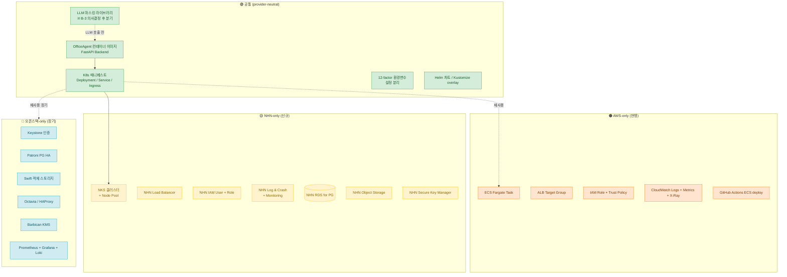

# 추상화 설계 — OfficeAgent 멀티 환경 배포

> [`MIGRATION_PLAN.md`](./MIGRATION_PLAN.md)가 "무엇을·언제·왜 옮기는가"라면, 본 문서는 "어떻게 한 애플리케이션을 여러 환경에 배포 가능하도록 추상화할 것인가"를 다룬다.

---

## 1. 추상화 목표

OfficeAgent를 AWS·NHN·오픈스택 세 환경에서 운영 가능하도록 코드·인프라·배포 구조를 분리한다.

| 영역 | 정의 | 본 과제 범위 |
|------|------|------------|
| **공통 (provider-neutral)** | 어디서 돌려도 동일하게 작동하는 부분 | 1차 우선 |
| **AWS-only** | AWS 매니지드 자원에 종속된 정의 (현행 유지) | 1차 우선 |
| **NHN-only** | NHN 매니지드 자원에 종속된 정의 (신규 추가) | 1차 우선 |
| **오픈스택-only** | OpenStack 자체 구축 시 재작성 필요 (장기 로드맵) | NHN-only 종속 식별까지만 |

---

## 2. 다이어그램

### 2.1 4영역 분리도



### 2.2 같은 컴포넌트가 환경별로 다르게 보이는 지점

| 컴포넌트 | AWS | NHN | 오픈스택 (장기) |
|----------|-----|-----|---------------|
| 컨테이너 오케스트레이션 | ECS Fargate Task | NKS + Deployment | Magnum + kubespray |
| 로드밸런서 | ALB Target Group | NHN LB | Octavia / HAProxy keepalived |
| 매니지드 DB | RDS Multi-AZ | NHN RDS for PostgreSQL | Patroni + etcd 자체 HA |
| 객체 스토리지 | S3 (네이티브) | NHN Object Storage (S3 호환 API 추정, Day 2 검증) | Swift (S3 호환 모드 가능) |
| 키 관리 | Secrets Manager | NHN Secure Key Manager | Barbican (+ HSM 옵션) |
| IAM | AWS IAM (Role + Trust Policy + Service-linked) | NHN IAM (User + Role) — **Trust Policy 직접 등가 없음** | Keystone (LDAP/AD 연동) |
| 로그·메트릭 | CloudWatch + X-Ray | NHN Log & Crash + Monitoring | ELK + Prometheus + Grafana + Loki |
| 알람·통보 | CW Alarm → SNS → Slack | NHN Monitoring → ? (Day 4 보강) → Slack | Alertmanager → Slack |
| 시크릿 주입 (런타임) | Task Role + Secrets Manager 자동 주입 | Pod ServiceAccount + Secret manifest (Secure Key Manager 동기 필요) | ServiceAccount + Vault sidecar |

→ 같은 K8s manifest를 4영역 모두에 적용 가능하지만, **secrets·LB·DB connection string·IAM identity는 환경별 분리** 필수. 이를 Kustomize overlay 또는 Helm values로 분리.

---

## 3. 도구 의사결정

### 3.1 IaC 도구 선택

**채택 (잠정)**: **Terraform** + AWS · NHN · OpenStack 멀티 프로바이더

**근거**:
- AWS 공식 Provider (`hashicorp/aws`) — 성숙도 최상
- NHN Cloud Provider (`nhncloud/nhncloud`) — 공식 지원, Day 4에 커버리지 직접 확인
- OpenStack Provider (`terraform-provider-openstack/openstack`) — 표준
- 세 환경 모두 같은 HCL 문법으로 다룰 수 있음 → 추상화 시그널 명확

**대안 후보 + 단점**:

| 대안 | 단점 |
|------|------|
| OpenTofu | Terraform fork (라이선스 자유). NHN Provider 호환성 미확인 → 본 일정엔 보수적 |
| Pulumi | 코드 친화적이지만 본인 학습 곡선 ↑. Track C 시그널보다 부담이 큼 |
| Crossplane | K8s native, 매력적. 다만 NHN Provider 미존재 추정. 학습 곡선 ↑ |
| Ansible | 명령형 + 멀티 클라우드 추상화 시그널 약함 (idempotent 약함) |
| IaC 없음 (다이어그램·문서만) | PRD §1.3 동등 평가지만 추상화 점수(20%) 약점 |

→ Day 4에 Terraform skeleton 시간 배분. 부담 시 `terraform validate`만 통과시키고 문서형 검증으로 보강 (PRD §1.3 명시).

### 3.2 모듈 구조 (Terraform 채택 시)

```
infra/
├── modules/                        # 추상 모듈 (provider 분기 없는 인터페이스)
│   ├── network/
│   │   ├── variables.tf            # cidr_block, subnet_count, az_count
│   │   ├── outputs.tf              # vpc_id, public_subnet_ids, private_subnet_ids
│   │   └── main.tf                 # provider별 root에서 wrapping
│   ├── compute/
│   │   ├── variables.tf            # node_count, instance_type, image_id
│   │   └── outputs.tf
│   ├── database/
│   │   ├── variables.tf            # engine_version, instance_class, multi_az
│   │   └── outputs.tf
│   └── storage/
│       ├── variables.tf            # bucket_name, lifecycle_days
│       └── outputs.tf
├── aws/                            # AWS root module
│   ├── main.tf                     # provider aws + VPC + ECS + RDS + S3
│   ├── network.tf
│   ├── compute.tf
│   ├── database.tf
│   └── outputs.tf
├── nhn/                            # NHN root module
│   ├── main.tf                     # provider nhncloud + 동등 자원
│   ├── network.tf
│   ├── compute.tf                  # NKS
│   ├── database.tf                 # NHN RDS for PG
│   ├── storage.tf                  # NHN OBS
│   └── outputs.tf
└── openstack/                      # OpenStack root module (장기, skeleton만)
    ├── main.tf
    └── outputs.tf
```

### 3.3 변수·환경 분리 전략

- **공통 변수**: `service_name = "officeagent"`, `environment`(dev/stage/prod), `tags`(공통 라벨)
- **AWS-only 변수**: `aws_account_id`, `aws_region = "ap-northeast-2"`, `vpc_cidr = "10.0.0.0/16"`
- **NHN-only 변수**: `nhn_user_id`, `nhn_password`, `nhn_region`(공공 전용 리전), `nhn_project_id`, `nhn_vpc_cidr`
- **오픈스택-only 변수**: `os_auth_url`, `os_username`, `os_project_name`, `os_domain_name`
- **시크릿·자격증명**:
  - AWS: AWS Secrets Manager (현행)
  - NHN: NHN Secure Key Manager
  - Terraform 실행 자격증명: 로컬 환경변수 (`AWS_PROFILE`, `OS_CLOUD`) + `terraform.tfvars`는 gitignore
  - 본 과제 범위 = 실 apply 없음 → placeholder 값 + `.tfvars.example`만 (PRD §3 명시)

---

## 4. NHN-only 종속의 솔직한 식별

> **추상화 사고의 핵심 시그널 (PRD §4 평가 20%)**. 오픈스택 단계에서 재작성 필요한 부분을 미리 식별. `MIGRATION_PLAN §3.2`와 동기 유지.

| 영역 | NHN-only 의존 | 오픈스택 대안 | 재작성 비용 | 비고 |
|------|-------------|------------|----------|------|
| DB | NHN RDS for PG (매니지드 backup·HA·monitoring) | PostgreSQL + Patroni + etcd | ★★★★ | failover 자동화 직접 구축 |
| 객체 스토리지 | NHN OBS (S3 호환 API 추정) | Swift (S3 호환 모드 가능) | ★★★ | 다중 노드 + replica 직접 |
| 키 관리 | NHN Secure Key Manager (자동 회전 + 감사 로그) | Barbican (+ HSM 옵션) | ★★★★ | HSM 도입 시 ★★★★★ |
| IAM·인증 | NHN IAM (User + Role) | Keystone (LDAP/AD 연동) | ★★★ | 사용자·그룹·정책 매핑 |
| 로드밸런서 | NHN LB (자동 failover + 헬스체크) | Octavia 또는 HAProxy keepalived | ★★★ | HA 직접 운영 |
| K8s | NKS (cluster 라이프사이클 매니지드) | Magnum + kubespray | ★★★★ | upgrade·node pool 운영 직접 |
| 로그·메트릭 | NHN Log & Crash + Monitoring | ELK + Prometheus + Grafana + Loki | ★★ | 잘 알려진 스택, 부담 적음 |
| 알람 라우팅 | NHN Monitoring → ? → Slack | Alertmanager → Slack | ★★ | 룰 규칙만 재정의 |

**재작성 비용 ★ 기준**:
- ★ = 설정만 (1주 미만)
- ★★ = 도구 교체 + 룰 재정의 (1~3주)
- ★★★ = 자체 운영 도구 도입 + 동등 기능 구성 (1~2개월)
- ★★★★ = HA·복구·감사 등 운영 영역 직접 구축 (2~4개월)
- ★★★★★ = 외부 의존 (HSM·전용 라이센스) 도입 비용 ↑↑

---

## 5. 운영 자동화 · AIOps 통합 지점 (선택)

본 과제 §1.3 검증 산출물의 선택 근거 보강 가능 (Day 4·5 시간 허용 시 `runbooks/`에 PoC). 본 1차 작성 단계에선 후보 지점만 명시.

| 통합 지점 | LLM 호출 입력 | 출력 | 의사결정 위치 |
|----------|------------|----|-----------|
| 알람 진단 | NHN Monitoring 알람 페이로드 + 최근 로그 (마스킹) | 가능한 원인 + 1차 대응 명령 | 운영자 (휴먼 인 더 루프) |
| 드리프트 비교 | `terraform plan` 결과 + 이전 plan | 의미 있는 변경 요약 + 위험도 | 운영자 (자동 alert) |
| 비용 이상치 | 일일 비용 메트릭 (NHN + AWS) | 평소 대비 변화 + 추정 원인 | 운영자 (주간 리포트) |

각 통합 지점에서 **LLM 호출 데이터에 민감 정보 포함 가능성** = 본 추상화의 핵심 보안 고려. B-3 의사결정과 동일 마스킹 라이브러리 재사용 (공통 영역, 다이어그램 §2.1의 `MASK` 노드).

---

## 6. 가정 · 미확인 영역

| 가정/미확인 | 영향 범위 | 리스크 | 검증 계획 |
|-----------|---------|------|---------|
| NHN Terraform Provider resource 커버리지 | IaC 채택 가능성 | 신규 NHN 서비스 자원 미지원 시 일부는 manual + Terraform 혼합 | Day 4: `registry.terraform.io/providers/nhncloud/nhncloud` 직접 확인 |
| **NKS의 CSAP 중등급 보유 여부** | C 도메인 회피 설계 필요성 | 미인증이면 NHN Instance + 자체 K8s 또는 IaaS 직접 사용 | Day 2~3: NHN docs + 공공기관용 NHN docs 직접 확인 |
| NHN OBS S3 호환 API 완전성 | B-2 sync 절차 단순성 | 부분 호환이면 NHN CLI 별도 사용 + 절차 분기 | Day 2~3: docs 직접 확인 + `aws s3 sync --dryrun` 시뮬레이션 |
| NHN Monitoring → Slack 외부 통보 절차 | D 도메인 자동화 PoC | 직접 webhook 미지원이면 중계 람다 필요 | Day 4: NHN Monitoring docs 직접 확인 |
| NHN 매니지드 서비스의 CSAP 인증 적용 범위 | 전체 설계 신뢰성 | 일부 서비스 미인증이면 회피 설계 필요 | Day 5: 공공기관용 NHN docs (`docs.gov-nhncloud.com`) SSL 우회 확인 |
| OpenStack Magnum K8s 운영 부담 | 장기 로드맵 일정 | 자체 K8s 운영 비용 ↑↑ | 본 과제 범위 외 (장기 검토) |

---

## 7. 참고 자료

§1차 자료 인용은 `MIGRATION_PLAN.md §8`과 동기. 본 문서 특화 자료:

- Terraform NHN Cloud Provider — `registry.terraform.io/providers/nhncloud/nhncloud` (Day 4 직접 확인)
- Terraform AWS Provider — `registry.terraform.io/providers/hashicorp/aws`
- Terraform OpenStack Provider — `registry.terraform.io/providers/terraform-provider-openstack/openstack`
- OpenStack 공식 docs — `docs.openstack.org` (Magnum / Keystone / Swift / Cinder / Neutron / Barbican / Octavia)
- CNCF Cloud Native Trail Map — 멀티 클라우드 추상화 영감 (부록)

---

_본 문서 v0.1 (2026-05-26 Day 2). §3.1 IaC 도구 채택은 잠정 — Day 4 NHN Provider 직접 확인 후 확정. §6 가정 6건은 Day 2~5에 누적 검증._
