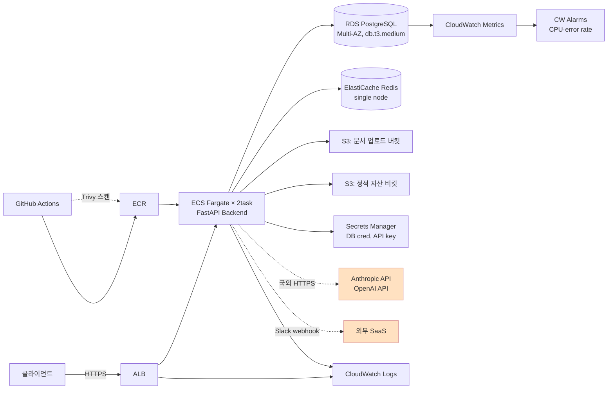

# 마이그레이션 설계서 — OfficeAgent AWS → NHN Cloud (CSAP 중등급)

> **목표 시나리오**: OfficeAgent를 AWS 일반 상용 운영을 유지하면서, 일반 공공 고객 신규 지원을 위해 NHN Cloud(CSAP 중등급 환경)에 추가 배포한다. 오픈스택 온프레미스는 장기 로드맵으로만 다루고 본 과제 범위는 NHN-only 종속 식별까지.
>
> **본 문서 작성 원칙**: PRD §6 불합격 트리거 회피 — 단순 매핑이 아닌 의사결정 박스 / 검증 산출물 동반 / 잠정 결론 명시 / 1차 자료 직접 인용 / AI 흔적 가시화(retros/).

---

## 0. 요약 (1페이지)

- **깊이 분석 도메인 2개**:
  - **A. 네트워크/보안** — CSAP 중등급 논리적 망분리, VPC↔NHN VPC 매핑, IAM↔NHN 권한
  - **B. 데이터/스토리지** — RDS→NHN DB 4h 무중단 이전, S3→Object Storage sync, **LLM API 외부 호출 데이터 주권** (난이도 최상)
- **목표 CSAP 등급**: 중등급 (일반 공공 업무 시나리오)
- **세 배포 환경 한 줄 요약**:
  - **AWS (현행 유지)**: 일반 상용 고객 운영
  - **NHN (신규 추가)**: 공공 전용 리전 + 논리적 망분리 + 국내 13개 IDC + CSAP 중등급 인증 환경
  - **오픈스택 (장기 로드맵)**: 국방·외교 시나리오 대비. 본 과제는 NHN-only 종속 식별까지
- **가장 큰 미해결 위험**: NHN RDS for PostgreSQL이 외부 PostgreSQL ↔ NHN 간 **logical replication을 공식 지원하지 않음** (Day 1 NHN docs 4건 직접 확인 결과) → `pg_basebackup` + Object Storage 경유 시 4h 다운타임 초과 가능. **잠정 대응**: 사전 incremental sync + 컷오버 윈도우 분할 + AWS DMS 옵션 추가 검증 (Day 3 §2.3 본문 + `VALIDATION.md` 합산 시뮬레이션 시나리오).

---

## 1. AWS 현황 분석

별첨 [`docs/PRD.md`](./docs/PRD.md) §부록 "별첨 AWS 스펙 골격" 기준. **이는 후보 평가용 가상 스펙**이며 실 운영 인프라 전체가 아님.

### 1.1 컴포넌트 의존성 다이어그램

### 1.2 비-기능 요건

| 항목 | 값 | 출처·해석 |
|------|----|---------|
| 동시 사용자 | < 200 | PRD §부록 |
| 일일 RPS 평균 / 피크 | 5 / 50 | PRD §부록 |
| 문서 업로드 | 일평균 500건 | PRD §부록 |
| **다운타임 허용** | **최대 4시간 (주말 야간 1회)** | PRD §부록 — 본 설계의 4h 검증 합산의 잣대 |
| **데이터 무손실** | 필수 | PRD §부록 |
| SLO | (PRD 명시 없음) | **잠정** 가용성 99.5% / p99 latency ≤ 1s — 본 문서가 임의 설정 |
| **CSAP 컴플라이언스** | NHN 단계부터 적용 | PRD §부록 — **중등급** (사용자 합의, 2026-05-26) |
| 외부 의존 (국외) | Anthropic + OpenAI API | PRD §부록 — **데이터 주권 핵심 난제** (Day 3 §2.3) |

### 1.3 정보 등급 분류 (CSAP 등급 결정 근거)

OfficeAgent가 처리하는 정보:
- **일반 업무 문서** (사용자 업로드, 일반 공공 업무 가정)
- **사용자 프롬프트 + LLM 응답** (개인정보 포함 가능)
- **세션·인증 토큰** (단기 보관)
- 국가 중요 정보 / 민감 개인정보 / 국방·외교 자료는 **본 시나리오 범위 밖** (오픈스택 장기 로드맵으로 분리)

→ **목표 CSAP 등급: 중등급** (일반 공공 업무 → 논리적 망분리 적용 가능 → NHN 퍼블릭 클라우드 가능)

근거 1차 자료: 클라우드법 §23조의2 / 과기정통부 「클라우드컴퓨팅서비스 보안인증에 관한 고시」 2024-02 개정안 (Day 2~3 추가 인용 보강).

---

## 2. NHN 대응 아키텍처

### 2.1 서비스 매핑 (전 영역, 간략)

> 깊이 도메인(A·B)은 §2.2·§2.3에서 의사결정 박스로 본문. 본 표는 1줄 매핑 + 핵심 차이만.

| AWS | NHN | 핵심 차이·주의 |
|-----|-----|--------------|
| VPC (10.0.0.0/16) | **NHN VPC** | 공공 전용 리전 선택 (CSAP 중등급 적용). 서브넷 3계층 동일 (Public-ALB / Private-App / Private-DB) — §2.2 |
| Application Load Balancer | **NHN Load Balancer** | L7 ALB 등가. 헬스체크·SSL terminate 가능 |
| ECS Fargate × 2task | **NHN Kubernetes Service (NKS)** + Deployment | Fargate 직접 등가 없음 → K8s 매니페스트로 재구성 |
| ECR | **NHN Container Registry** | 표준 OCI 이미지 push/pull |
| **RDS PostgreSQL (Multi-AZ)** | **NHN RDS for PostgreSQL** | ⚠ **logical replication 미지원** (Day 1 발견) → 마이그레이션 방식 = `pg_basebackup` + Object Storage 경유. PG 버전: 14/17 지원 — AWS RDS와 동일 minor 맞춤 — §2.3 / §4 / §7 |
| S3 (문서 + 정적 자산) | **NHN Object Storage** | S3 호환 API 지원 여부 Day 2 보강 확인 — §2.3 / §6 |
| ElastiCache Redis (single) | **NHN Cache Service (Redis)** | single node 동등. 세션·캐시 영속화 불필요 |
| Secrets Manager | **NHN Secure Key Manager** | 키 소유·통제 주체 명시 필요 — §2.3 의사결정 박스 B-4 |
| CloudWatch Logs | **NHN Log & Crash** | 로그 수집·검색 |
| CloudWatch Metrics + Alarms | **NHN Monitoring** | 메트릭 + 알람. Slack 연동 방식 Day 4 보강 |
| X-Ray (선택, 일부 트레이스) | (대응 미정) | 트레이싱 우선순위 낮음 — 본 과제 범위 밖 |
| IAM (Role / Policy) | **NHN IAM** | Role의 trust policy 직접 등가 없음 → 명시적 식별 — §2.2 의사결정 박스 A-3 |
| GitHub Actions + Trivy | (외부 유지 — GitHub Actions 그대로) | NHN Container Registry로 푸시 대상만 변경. Trivy 이미지 스캔 단계 유지 |
| Anthropic + OpenAI API | (동일, 국외 호출 유지 또는 대안) | **데이터 주권 핵심 난제** — §2.3 의사결정 박스 B-3 (마스킹 vs 국산 vs 온프레미스 LLM) |
| 외부 SaaS (Slack) | (동일) | 웹훅 호출, 데이터 흐름 점검 필요 |

### 2.2 깊이 분석 — A 네트워크/보안

> Day 3에 본문 + 의사결정 박스 6요소. 본 자리는 다룰 의사결정 목록 + Day 3 진입점.

다룰 의사결정 (잠정 후보):
- **A-1** VPC↔NHN VPC 매핑 + 서브넷 3계층 + Security Group 매핑
- **A-2** CSAP 중등급 논리적 망분리 zone 설계 (관리망 / 업무망 / 외부 통신 zone)
- **A-3** IAM↔NHN 권한 모델 (Role trust policy 직접 등가 없는 부분 명시 + Workload identity 대안)

각 의사결정은 6요소(잠정 결론·1차 자료 근거·대안·트레이드오프·리스크·검증 계획) 필수.

### 2.3 깊이 분석 — B 데이터/스토리지

> Day 3에 본문 + 의사결정 박스 6요소. Day 1 1차 자료 4건(NHN docs)이 핵심 시드.

다룰 의사결정 (잠정 후보):
- **B-1** RDS→NHN RDS for PostgreSQL **4h 무중단 이전** — Day 1 발견 기반. 잠정 = `pg_basebackup` + Object Storage 경유. 대안 = AWS DMS / pg_dump / 더블 라이트 — 4h 합산 검증 시나리오 동반 (`VALIDATION.md`)
- **B-2** S3 → NHN Object Storage **sync 전략** — S3 호환 API 가용성 + `aws s3 sync` 대응 절차
- **B-3** **LLM API 외부 호출 데이터 주권** (Anthropic + OpenAI = 국외) — 마스킹 vs 국산 모델(HyperCLOVA X 등) vs 온프레미스 LLM 트레이드오프 (대안별 응답 품질·비용·구현 부담)
- **B-4** **KMS 통제 주체** — AWS Secrets Manager → NHN Secure Key Manager. 키 소유권·접근 정책·감사 로그 명시

### 2.4 다른 도메인 (얕은 매핑)

#### C. 컴퓨트 / 배포
- **잠정 매핑**: ECS Fargate → NHN Kubernetes Service (NKS). 컨테이너 이미지 + Deployment·Service·Ingress 매니페스트
- **배포 전략**: 블루/그린 또는 카나리 — NKS의 Service + label 선택. 4h 컷오버 윈도우 안에 표준 K8s rolling deploy로 충분
- **미확인 가정**: NKS의 CSAP 중등급 인증 보유 여부. (NHN의 CSAP 인증은 IaaS 기준 — NKS는 별도 확인 필요. Day 2 NHN docs 보강)
- **리스크 + 추후 학습**: NKS 미인증이면 NHN 자체 Instance + 자체 K8s 또는 docker-compose 회피. Day 4 NHN docs 확인 후 보강

#### D. 운영 · 관측 / AIOps
- **잠정 매핑**: CloudWatch → NHN Log & Crash (로그) + NHN Monitoring (메트릭·알람)
- **LLM 통합 PoC** (선택 산출물 `runbooks/`): 알람 진단 자동화 — Day 4·5 시간 허용 시 검토
- **미확인 가정**: Slack 등 외부 SaaS로 알람 전달 시 페이로드에 민감 정보 포함 가능성 — 마스킹 필요
- **리스크 + 추후 학습**: Day 4 NHN Monitoring docs 직접 확인

#### E. 비용 / 규제
- **잠정 매핑**: NHN·AWS 모두 가상 트래픽(동시 < 200) 규모는 소규모 구간 → 컴퓨트·트래픽 비용 차이 ≤ 30% 추정
- **추가 비용**: CSAP 중등급 인증 수수료 (5천만~1억원+) + 인증 준비 인프라 (망분리 zone·감사 로그 보존)
- NHN CSAP 프로모션 활용 시 인프라 500만원 크레딧 + 전담팀
- **ISMS-P**: CSAP과 별개 인증. 본 과제 범위 밖이지만 §시간축에 명시 (정보보호 관리체계 인증, 2년 유효)
- **2027 정책 통합**: 과기정통부 CSAP + 국정원 보안검증 통합 예정 — 장기 로드맵 일정축에 반영
- **미확인 가정**: NHN 정확 가격 (Day 4 docs.nhncloud.com 가격 페이지 확인)

---

## 3. 오픈스택 (장기) 대응

### 3.1 NHN과의 재사용 가능 영역

| 항목 | NHN 단계 재사용 | 오픈스택 단계 재설계 |
|------|:---------------:|:--------------------:|
| 애플리케이션 컨테이너 이미지 | ✓ | ✓ |
| K8s 매니페스트 (Deployment, Service, Ingress) | ✓ | ✓ (Keystone 인증 부분만 조정) |
| 12-factor 환경변수 + 설정 분리 | ✓ | ✓ |
| Helm 차트 / Kustomize overlay | ✓ | ✓ |
| 매니지드 PostgreSQL | ✓ (NHN RDS) | ✗ (Patroni 등 자체 HA 구축) |
| 매니지드 Object Storage | ✓ (NHN OBS) | ✗ (Swift 자체 구축·운영) |
| 매니지드 KMS | ✓ (NHN Secure Key Manager) | ✗ (Barbican 자체 구축) |
| 매니지드 IAM | ✓ (NHN IAM) | ✗ (Keystone 자체 구축) |
| 매니지드 LB | ✓ (NHN LB) | ✗ (Octavia 또는 HAProxy) |
| 매니지드 로그·메트릭 | ✓ (NHN Log & Crash / Monitoring) | ✗ (자체 ELK + Prometheus) |
| 매니지드 K8s | ✓ (NKS, 단 인증 확인 필요) | ✗ (kubespray 또는 OpenStack Magnum) |

### 3.2 NHN-only 종속 식별 (오픈스택 단계 재작성 대상)

| 영역 | NHN-only 의존 | 오픈스택 대안 | 재작성 비용 |
|------|-------------|------------|----------|
| 데이터베이스 | NHN RDS for PostgreSQL | PostgreSQL + Patroni + etcd | ★★★ (HA·백업 운영 부담) |
| 객체 스토리지 | NHN Object Storage | OpenStack Swift | ★★★ (다중 노드 + replica 운영) |
| 키 관리 | NHN Secure Key Manager | Barbican + HSM 연동 | ★★★ (HSM 도입 시 비용 ↑) |
| IAM·인증 | NHN IAM | Keystone | ★★ (LDAP/Active Directory 연동) |
| 로드밸런서 | NHN Load Balancer | Octavia / HAProxy | ★★ (HA + 자동 failover 직접 운영) |
| K8s | NHN Kubernetes Service | OpenStack Magnum + kubespray | ★★★★ (cluster 라이프사이클 자체 운영) |
| 모니터링·로그 | NHN Monitoring + Log & Crash | Prometheus + Grafana + Loki/ELK | ★★ (지표·알림 정의 동등 재구성) |

→ 본 추상화 사고를 `ARCHITECTURE.md §4`에서 그림으로 명시. NHN-only / 공통 / 오픈스택-only 4영역 분리도.

### 3.3 재설계 우선순위 (장기, 본 과제 범위 외)

NHN 1차 배포 성공 후 12~24개월 시점에서 검토:
1. **핵심 데이터·키 통제** (PostgreSQL HA + Barbican) — 데이터 주권 절대 요구 시점
2. **객체 스토리지** (Swift) — 사용량·비용에 따라
3. **네트워크 + LB** (Neutron + Octavia)
4. **인증** (Keystone)
5. **관측·로깅** (자체 스택)

본 1차 OfficeAgent NHN 배포가 성공·안정화된 후 별도 의사결정.

---

## 4. 마이그레이션 단계 · 롤백 전략

> NHN 신규 추가 시나리오 (AWS는 운영 유지). 데이터 이전은 컷오버 윈도우 1회로 한정 (PRD §부록 4h 다운타임 제약).

### 4.1 단계별 마일스톤 (시간순)

| 단계 | 기간 | 작업 | 검증 | 롤백 트리거 |
|------|------|------|------|------------|
| **1. 준비** | T-7 ~ T-1 | NHN 공공 전용 리전 계정·CSAP 중등급 환경 신청 / VPC·서브넷·SG 설계 + 사전 적용 / IAM 사용자·Role 생성 / NKS 클러스터 사전 구축 / 컨테이너 이미지 NHN Container Registry 푸시 / Object Storage 버킷 생성 / **AWS S3 → NHN Object Storage `incremental sync` 시작** | NHN 콘솔 접속 + 이미지 pull 확인 + Object Storage put/get + sync 진행률 확인 | 작업 자체 실패 → 다음 윈도우 연기 (운영 영향 0) |
| **2. NHN 환경 구축** | T-3 ~ T-1 | NHN RDS for PostgreSQL 인스턴스 생성 (PG minor 버전 = AWS RDS와 동일) / NHN Cache Service · LB 설정 / SG 적용 / Monitoring · Log & Crash 활성 / NKS 애플리케이션 배포(트래픽 차단 상태) / **Object Storage incremental sync 계속** | DB 인스턴스 ping + 빈 schema 적용 + 헬스체크 / 애플리케이션 컨테이너 로그 + Redis 연결 / sync 잔여 차이 < 1GB 확인 | DB·NKS 생성 실패 → 다음 윈도우 연기 |
| **3. 데이터 이전** ★ | **T+0 ~ T+4h (다운타임 윈도우)** | T+0:00 AWS RDS write 차단 + S3 잔여 sync 마무리 → pg_basebackup → AWS S3 → NHN Object Storage 마지막 전송 → NHN RDS 신규 인스턴스 복원 → schema·data 검증 → 헬스체크 | row count + MD5 hash 비교 SQL + sample query 결과 일치 (`VALIDATION.md` B-1·B-2 시나리오) | T+3h 시점 누적 70% 미만 진행 → 작업 중단 + AWS RDS write 차단 해제 → 다음 윈도우 재시도 |
| **4. 컷오버** | T+4h ~ T+4.5h | DNS 전환 (TTL 300s로 사전 단축) → 애플리케이션 트래픽 NHN으로 → AWS RDS는 **read-only 전환** (안전망) | 첫 100개 요청 성공률 ≥ 99% / 에러율 ≤ 1% / p99 latency ≤ AWS 기준 + 50ms | 에러율 ≥ 5% 또는 p99 latency ≥ 2배 → **DNS 즉시 복귀** (AWS RDS read-only 해제) |
| **5. 안정화** | T+4.5h ~ T+24h | 모니터링 메트릭 추적 / 에러 알람 대기 / 24h 후 AWS RDS 종료 결정 | 24h 동안 에러율 ≤ 1% + p99 latency 안정 + Slack 알람 0건 | 임계 초과 시 4단계 롤백 적용 + AWS RDS 종료 결정 보류 |

### 4.2 4시간 다운타임 제약 충족 근거 (잠정)

**가정**: OfficeAgent RDS 데이터 크기 = 10~50GB (가상 트래픽 1년 운영 추정). 본 가정은 Day 3 검증 시나리오에서 정량 시뮬레이션으로 재검증.

| 마일스톤 | 추정 소요 (최선~최악) | 비고 |
|----------|--------------------|----|
| T+0:00 AWS RDS write 차단 + 마지막 백업 | 5분 | |
| T+0:05 `pg_basebackup` 실행 (10~50GB) | 15~60분 | 압축 + 멀티 part 가속 |
| T+1:05 AWS S3 → NHN Object Storage 잔여 전송 | 5~20분 | **사전 incremental sync**로 잔여 차이만 (전체 30~120분 → 5~20분으로 단축) |
| T+1:25 NHN RDS 신규 인스턴스 + 복원 | 30~90분 | NHN docs `pg_basebackup 동일 버전` 요건 충족 |
| T+2:55 검증 (row count + MD5) | 15~30분 | `VALIDATION.md` B-1 시나리오 |
| **누적 (최선~최악)** | **1.0h ~ 3.4h** | **4h 안에 들어옴 (사전 sync 전략 가정 시)** |

→ **사전 incremental sync 전략 없이는 5.5h까지 가능 → 4h 초과**. Day 1 발견의 정직한 명시 + 사전 sync 활용으로 4h 안에 충족 가능 잠정 결론.

**잠정 결론**: 사전 incremental sync (S3 → NHN OBS) + pg_basebackup 경로로 4h 다운타임 충족 가능. 검증 시나리오: `VALIDATION.md` B-1 (합산 시뮬레이션) + B-2 (Object Storage sync dry-run).

### 4.3 실패 시 복귀 경로

- **3단계 실패** (데이터 이전 임계 초과): AWS RDS write 차단 해제 → 다음 주말 윈도우로 연기. NHN 측 신규 인스턴스는 유지 (재시도용)
- **4단계 실패** (컷오버 후 에러율 초과): DNS 즉시 복귀 + AWS RDS read-only 해제 → 다음 윈도우 재시도. 평균 복귀 시간 = DNS TTL 300s + 클라이언트 캐시 ≤ 10분
- **5단계 실패** (안정화 중 임계 초과): 4단계 롤백 + 사고 분석 → AWS RDS 종료 결정 보류. NHN 측 인스턴스는 디버그용 유지

---

## 5. 비용·규제·성능 트레이드오프

> Day 4·5 보강. 본 자리는 자리만 마련.

### 5.1 비용 비교 (정량)

Day 4에 NHN 가격 페이지 직접 확인 후 표 작성. 주요 비교 항목: 컴퓨트(NKS) / 데이터(RDS PG) / 트래픽 / 스토리지(OBS) / 모니터링.

### 5.2 CSAP·망분리 설계 반영

Day 3 §2.2 깊이 분석과 연동. CSAP 중등급 13개 분야 79개 통제항목 중 본 설계가 충족하는 항목·미충족 항목 표.

### 5.3 성능

Day 4 보강 (p50/p99 latency 예상치 + AWS 대비 차이).

---

## 6. 검증 계획 / 리허설

> **본 섹션은 별도 [`VALIDATION.md`](./VALIDATION.md)로 분리합니다** (PRD §1.3 동등 평가). Day 3에 작성.

검증 시나리오 요약 (Day 3 본문 예정):
- **A-1**: NHN VPC + 서브넷 CIDR 매핑 검증 (`terraform validate` 또는 NHN 콘솔 화면 + docs 인용)
- **A-2**: CSAP 중등급 망분리 zone 다이어그램 + 통제항목 매핑 표
- **B-1**: RDS→NHN RDS 4h 합산 시뮬레이션 (입력·명령·기대·실패판단 4종 + 롤백 트리거)
- **B-2**: S3→NHN OBS sync dry-run (`aws s3 sync --dryrun` + NHN CLI 등가)
- **B-3**: LLM API 마스킹 함수 단위 테스트 (입력 → 마스킹 → 검증)
- **B-4**: KMS 통제 주체 시나리오 (키 발급·회전·접근 감사 로그)

---

## 7. 가장 큰 미해결 위험

### 7.1 NHN RDS for PostgreSQL — logical replication 미지원에 따른 4h 다운타임 초과 가능성

**Day 1 발견** (NHN docs 4건 직접 확인):
- `docs.nhncloud.com/.../db-instance/` 인용: *"외부 PostgreSQL의 마스터로부터 강제로 복제하도록 설정하면 고가용성 및 일부 기능들이 정상적으로 동작하지 않습니다"*
- `parameter-group` 페이지 — wal_level / max_wal_senders / max_replication_slots 키워드 0건
- `backup-and-restore` 페이지 — `pg_basebackup 동일 버전` 요건 명시 + Object Storage 경유 import 가능

**잠정 대응**:
- 사전 incremental sync (S3 → NHN OBS) + pg_basebackup 경로로 4h 충족 (§4.2)
- AWS DMS 옵션 추가 검증 (Day 3)
- 4h 미충족 발견 시 컷오버 윈도우 분할 (1차 read-only 데이터 / 2차 mutable 데이터)

**검증 계획**: `VALIDATION.md` B-1 시나리오 (합산 시뮬레이션 + 4h 초과 시 분기).

### 7.2 LLM API 외부 호출 — 데이터 주권 위반 소지

**근거**: 클라우드법 §18 / 개인정보보호법 §28의2 — 개인정보 국외 이전 제한 (별도 동의·고지 필요). Anthropic + OpenAI = 국외 서버.

**잠정 대응** (Day 3 §2.3 본문 + 검증 시나리오):
1. **호출 전 마스킹·비식별화** (1순위) — 개인정보 추출·치환 후 LLM 전송
2. **감사 로그** 모든 LLM 호출 기록 (전송 데이터 메타·응답 메타·재현 가능 ID)
3. **국산 모델 옵션** (HyperCLOVA X 등) — 응답 품질 비교 검증 시나리오
4. **온프레미스 LLM** (오픈스택 단계 옵션) — 자체 호스팅 오픈 모델

**검증 계획**: `VALIDATION.md` B-3 시나리오 (마스킹 함수 단위 테스트).

### 7.3 NHN의 CSAP 중등급 보유 서비스 범위 미확인

**상황**: NHN Cloud 자체는 IaaS CSAP 최초 인증을 보유하지만, **개별 매니지드 서비스**(NKS / OBS / KMS 등)의 CSAP 중등급 적용 범위는 Day 1 시점 미확인.

**잠정 대응**: Day 2 NHN docs + 공공기관용 NHN Cloud(`docs.gov-nhncloud.com`) 직접 확인. 일부 서비스가 미포함이면 NHN 자체 Instance + 자체 K8s 또는 IaaS 직접 사용으로 회피 설계.

**검증 계획**: Day 2·5에 NHN 공식 docs URL + 캡처를 §8에 추가.

---

## 8. 참고 자료

### Day 1 수집 (NHN docs 직접 확인, 인용 박제)

1. **NHN Cloud RDS for PostgreSQL — DB 엔진** — `docs.nhncloud.com/ko/Database/RDS%20for%20PostgreSQL/ko/db-engine/`
   - 인용: PostgreSQL 14 (14.6/14.15/14.17/14.19) + PostgreSQL 17 (17.2/17.4/17.6) 지원. **logical/replication/wal 키워드 0건**
2. **NHN Cloud RDS for PostgreSQL — DB 인스턴스** — `docs.nhncloud.com/ko/Database/RDS%20for%20PostgreSQL/ko/db-instance/`
   - 인용: *"PostgreSQL 쿼리문으로 다른 DB 인스턴스 또는 외부 PostgreSQL의 마스터로부터 강제로 복제하도록 설정하면 고가용성 및 일부 기능들이 정상적으로 동작하지 않습니다"*
3. **NHN Cloud RDS for PostgreSQL — Parameter Group** — `docs.nhncloud.com/ko/Database/RDS%20for%20PostgreSQL/ko/parameter-group/`
   - 인용: wal_level / max_wal_senders / max_replication_slots **언급 0건**
4. **NHN Cloud RDS for PostgreSQL — Backup and Restore** — `docs.nhncloud.com/ko/Database/RDS%20for%20PostgreSQL/ko/backup-and-restore/`
   - 인용: *"외부 PostgreSQL의 백업으로 복원하거나 RDS for PostgreSQL의 백업으로 복원하기 위해서는 RDS for PostgreSQL에서 사용하는 pg_basebackup과 동일한 버전을 사용해야 합니다"* + Object Storage 경유 import 가능

### Day 2~5 추가 수집 예정

- NHN Object Storage / KMS / VPC / IAM / 리전 가이드 / NKS docs
- 공공기관용 NHN Cloud — `docs.gov-nhncloud.com` (SSL 우회)
- CSAP 고시 2024-02 개정안 (과기정통부)
- KISA 인증 운영 가이드 — `isms-p.or.kr`
- 법령 — `law.go.kr` 클라우드법 §18·§23조의2, 개인정보보호법 §24·§28의2, 정보통신망법 §25
- OpenStack docs (Neutron/Cinder/Swift/Keystone) — 장기 로드맵 §3 매핑 근거

---

_본 문서 v0.1 (2026-05-26 Day 2). §2.2·§2.3 본문은 Day 3, §5·§6 본문은 Day 3~4, §7 추가 위험은 Day 3~5에 누적 갱신._
