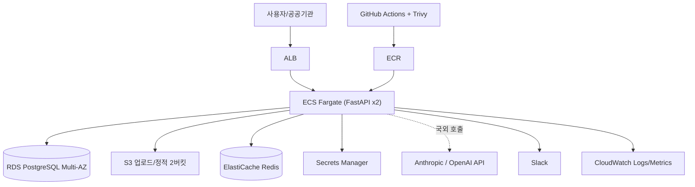

# 마이그레이션 설계서 — OfficeAgent 멀티 환경 배포

> AWS 운영 중인 OfficeAgent를 정부·공공 규제 대응을 위해 **NHN 클라우드(중등급) + 오픈스택 온프레미스(상등급)**에도 배포 가능하도록 하는 설계.
> 깊이 도메인 = **A. 네트워크/보안**, **B. 데이터/스토리지**. 평가 기준 [`docs/PRD.md`](./docs/PRD.md) §4.
>
> ⚠️ **인용 신뢰도 표기 규칙**: 이 문서의 1차 자료는 2026-06-17 조사 시점 기준이며, 본 작업 환경에서 `WebFetch`가 차단되어 **검색 스니펫 기반으로 검증**했다. 원문 직접 대조가 끝난 항목만 *[확인됨]*, 보조자료·미대조 항목은 *[부분확인]* / *[미확인]*으로 표기한다. 이는 §7 리스크 + [`VALIDATION.md`](./VALIDATION.md)에서 검증 대상으로 다룬다.

---

## 0. 요약 (1페이지)

- **깊이 분석 도메인 2개**: A. 네트워크/보안 · B. 데이터/스토리지
- **세 배포 환경 한 줄 요약**:
  - **AWS (현행)** — 일반 상용 고객 유지. 버리지 않는다.
  - **NHN (1차 타깃)** — **CSAP 중등급 / 논리적 망분리 / 공공기관 전용 리전**. AWS와 서비스 매핑이 비교적 1:1에 가까움(S3 호환, 동명 VPC). 데이터 국내 보관(13개 IDC) 충족.
  - **오픈스택 온프레미스 (장기)** — **CSAP 상등급 / 물리적 망분리 / 폐쇄망 국방·최고규제**. 매니지드 서비스를 자체 구축으로 재작성(Trove·Octavia·Barbican·Magnum 등)하는 영역이 핵심.
- **설계 앵커**: 목표 CSAP 등급이 망분리 방식을 가른다 — **상=물리(퍼블릭 불가→오픈스택), 중·하=논리(NHN 가능)**. 따라서 본 설계의 핵심은 단일 코드베이스를 **공통 / AWS-only / NHN-only / 오픈스택-only**로 분리하는 추상화([`ARCHITECTURE.md`](./ARCHITECTURE.md)).
- **가장 큰 미해결 위험 1개**: **NHN RDS for PostgreSQL의 무중단 마이그레이션 전용 도구(DMS)가 공식 문서에서 확인되지 않음** — 외부 DB 이전 공식 안내는 `pg_dump`(dump/restore)뿐. 4시간 다운타임 충족이 DB 용량에 의존. → 잠정 결론은 **pg_dump 병렬 + 사전 증분 동기**, 대안은 **엔진 레벨 logical replication 수동 구성**. 둘 다 §4.2·VALIDATION에서 시간 합산·검증.

---

## 1. AWS 현황 분석

별첨 [`docs/PRD.md` §부록](./docs/PRD.md) 가상 AWS 스펙(ap-northeast-2) 기준.

### 1.1 컴포넌트 의존성

> 정식 다이어그램(4영역 추상화)은 [`assets/architecture-layers.drawio`](./assets/architecture-layers.drawio) — [`ARCHITECTURE.md`](./ARCHITECTURE.md) 참조. 아래는 현행 AWS 의존성 빠른 보기.

**데이터 주권 관점의 핵심 경계** = 점선(`ECS -. 국외 호출 .-> LLM`). 이 한 줄이 B 도메인 최대 난제(§2.3 B-4).

### 1.2 비-기능 요건 (잠정 해석)

| 항목 | 값 | 설계 함의 |
|------|----|-----------|
| 동시 사용자 | < 200 | 소규모 — NHN LB·NKS 최소 구성으로 충분 |
| RPS | 평균 5 / 피크 50 | 오토스케일 여유 큼. 컷오버 부하 낮음 |
| 문서 업로드 | 일 500건 | Object Storage 쓰기 부하 낮음 → 증분 sync 용이 |
| **다운타임 허용** | **최대 4h (주말 야간 1회), 무손실** | **B의 컷오버 설계를 지배하는 제약** |
| 컴플라이언스 | CSAP(망분리·암호화·감사로그) | NHN 단계부터 적용 가정 |

> **잠정 결론**: 트래픽이 작아 컴퓨트·네트워크 전환 난이도는 낮다. **난이도는 (1) 데이터 무손실 4h 이전, (2) LLM API 데이터 주권, (3) 상등급 오픈스택 재작성**에 집중된다. 그래서 깊이 도메인을 A·B로 잡았다.

---

## 2. NHN 대응 아키텍처

### 2.1 서비스 매핑 (전 영역, 간략)

| AWS | NHN | 오픈스택(장기) | 비고 |
|-----|-----|---------------|------|
| VPC / Subnet / SG | VPC / Subnet / Security Group | Neutron | 동명·동개념. NHN은 공공 전용 리전 논리분리 *[확인됨]* |
| NAT Gateway | NAT Gateway (관리형) / NAT Instance | Neutron Router | NHN은 NAT Gateway·NAT Instance 2종 공존 — Gateway가 AWS 대응 *[확인됨]* |
| ALB | Load Balancer | Octavia | NHN LB의 L7 세부는 *[부분확인]*. Octavia=amphora(VM per LB) |
| ECS Fargate | NKS(+NCR) / NCS | Nova + Magnum / 외부 K8s | Fargate↔NKS 1:1 아님. NCS는 리전 한정(판교·광주) *[확인됨]* |
| RDS PostgreSQL | RDS for PostgreSQL | Trove(PG 미성숙) / Nova+Cinder 직접 | **외부이전=pg_dump** *[확인됨]*. Trove PG는 1급 지원 아님 |
| S3 | Object Storage | Swift(+s3api) | **S3 호환 API** → `aws s3 sync` 가능 *[확인됨]* |
| ElastiCache Redis | EasyCache(Valkey/Redis) | Nova VM에 Redis 직접 | EasyCache **영속성 미제공** — 세션/캐시 한정 *[확인됨]* |
| KMS / Secrets Manager | Secure Key Manager | Barbican / Vault | IP·MAC·인증서 기반 접근통제 *[확인됨]* |
| CloudWatch | Log & Crash Search + Monitoring | 자체 Prometheus/Grafana/Loki | 로그·메트릭 분리(통합 아님) *[부분확인]* |
| IAM | NHN 프로젝트/멤버 권한 | Keystone | 정책 모델 다름 → role+scope 재설계 |
| ECR | NCR | Harbor 등 | |

> 이 표가 "단순 1:1 매핑"으로 끝나지 않도록, A·B의 의사결정은 §2.2·§2.3에서 트레이드오프와 함께 전개한다. 비고열의 *[확인됨]/[부분확인]* 표기가 조사 깊이의 증거다.

---

### 2.2 깊이 분석 — A. 네트워크 / 보안

#### A-1. 목표 CSAP 등급 결정 (모든 망분리 설계의 출발점)

- **잠정 결론**: OfficeAgent를 **NHN = 중등급(논리적 망분리)** 1차 타깃, **오픈스택 = 상등급(물리적 망분리)** 장기 트랙으로 이원화한다. 정보 등급은 "비공개 공공 업무자료(개인정보 포함 가능)"로 가정.
- **근거**: CSAP 고시상 **상=물리 망분리(서버 물리 분리)·중·하=논리 망분리 허용** *[부분확인 — KISA/etnews]*. 상등급은 외부망 차단·감사로그 통합·접근통제 자동화 등 강화항목이 신설되어 퍼블릭 클라우드만으로는 충족 곤란 → 오픈스택 온프레미스 필요. 법적 근거: 클라우드법 §23의2(CSAP) *[확인됨]*, 개보법 §29 안전조치의무 *[확인됨]*.
- **대안**: ① 전 고객 상등급 단일화(오픈스택만) — 일반 공공까지 과잉 비용·운영부담. ② 전 고객 NHN 중등급 — 국방·최고규제 고객 납품 불가. → **이원화가 비용/규제 균형점**.
- **트레이드오프**: 이원화는 코드베이스 추상화 비용(공통/환경별 분리)을 발생시키나, 단일화의 과잉비용·납품불가 리스크보다 작다.
- **리스크**: OfficeAgent 실제 처리 정보 등급이 "민감 개인정보"면 NHN 중등급으로 부족 → 상등급 강제. 2025-10-31 **망분리 위험기반 전환** + 2026 **CSAP→CSO 재편 논의**로 등급 기준 변동 가능 *[부분확인]*.
- **검증 계획**: 고객별 정보 등급 분류 워크시트 작성 → 목표 등급 확정. CSAP 고시 별표 원문(통제항목)으로 등급별 요구 직접 대조(WebFetch 차단으로 미수행 → 캡처 단계 보강).

#### A-2. 망분리·네트워크 토폴로지 (VPC↔NHN VPC↔Neutron)

- **잠정 결론**: AWS의 `VPC(10.0.0.0/16) + Public×2 + Private×2 + SG(ALB→App→DB)` 토폴로지를 **NHN VPC에 동형 이식**(논리 망분리), 오픈스택에서는 **Neutron으로 동형 + 물리 분리 + 폐쇄망(인터넷 차단)** 재구성.
- **근거**: NHN VPC는 "logically isolated virtual network"로 subnet·routing table·gateway·Security Group을 AWS와 동일 개념 제공 *[확인됨, docs.nhncloud.com/.../Network/VPC]*. 외부연결은 NHN **NAT Gateway**(관리형)가 AWS NAT Gateway에 대응 *[확인됨]*. 오픈스택은 Neutron(network/subnet/router/SG, 기본 deny) + Octavia(LB) *[확인됨, docs.openstack.org]*.
- **대안**: NHN에서 NAT Instance(직접 운영 NAT 서버) 사용 — 관리 부담↑. → 관리형 NAT Gateway 채택.
- **트레이드오프**: 동형 이식은 학습비용 최소·검증 용이. 단 오픈스택 상등급은 **인터넷 완전 차단**이라 ECR/패키지/LLM API 접근 경로를 전부 내부 미러·프록시로 재설계해야 함(폐쇄망 비용).
- **리스크**: NHN LB의 **L7(경로기반) 라우팅**이 AWS ALB와 동등한지 *[부분확인]*. Octavia는 **amphora(LB당 VM)** 모델이라 ELB 완전관리형과 운영 격차.
- **검증 계획**: A 도메인 VALIDATION 시나리오 = NHN/오픈스택 네트워크 Terraform `validate` 통과 + SG 흐름(ALB→App→DB only) 정적 검증. NHN LB 콘솔 가이드로 L7 지원 확인.

#### A-3. 자격·권한 (IAM → NHN 권한 / Keystone)

- **잠정 결론**: AWS IAM Role(Task/Execution)의 **최소권한 정책을 의미 단위로 재설계**해 NHN 멤버 권한 / 오픈스택 **Keystone domain·project·role**에 매핑한다. **1:1 자동 변환은 하지 않는다**.
- **근거**: Keystone은 domain(관리경계)·project(자원격리=테넌트)·role(스코프) 모델이며 Rocky 이후 admin/member/reader 3 기본 롤 제공 *[확인됨]*. AWS IAM의 리소스 단위 JSON 정책과 모델이 근본적으로 달라 재설계가 불가피.
- **대안**: IAM 정책을 그대로 옮기려는 변환 도구 시도 — 모델 불일치로 깨짐. → 의미 기반 재설계.
- **트레이드오프**: 재설계는 초기 공수↑이나 최소권한 원칙을 환경별로 일관 적용 가능.
- **리스크**: 페더레이션(SAML/OIDC)로 사내 IdP 연동 시 환경별 클레임 매핑 차이.
- **검증 계획**: 역할 매트릭스(주체×액션×환경) 표 + Keystone role 부여 스크립트 dry-run.

#### A-4. 감사 로그·암호화 (CSAP 기술통제)

- **잠정 결론**: 전송구간 TLS + 저장 암호화(키는 §2.3 B-3의 Secure Key Manager/Vault) + **접속기록·감사로그를 중앙 수집**(NHN Log & Crash + Monitoring / 오픈스택 자체 ELK·Loki). 개보법 §29·시행령 안전성 확보조치 기준 충족.
- **근거**: 개보법 §29 "접속기록 보관 등 기술적·관리적·물리적 조치" *[확인됨]*. CSAP 상등급은 감사로그 통합관리 신설 *[부분확인]*.
- **리스크/검증**: 망분리 법적 근거는 **개보법 시행령 §48의2**(과거 정보통신망법 §25 아님 — §8 교정 참조). 조문 원문 대조 미수행 → 캡처 보강.

---

### 2.3 깊이 분석 — B. 데이터 / 스토리지

#### B-1. RDS PostgreSQL 4시간 무손실 이전 ★최대 난제

- **잠정 결론**: 1차안 = **`pg_dump -Fc -j`(병렬 덤프) → 전송 → `pg_restore -j`(병렬 복원)** + 컷오버 직전 쓰기 중단(유지보수 모드). DB 용량이 4h 예산을 초과하면 2차안 = **엔진 레벨 logical replication 수동 구성(PG14 publication/subscription)으로 사전 동기 후 짧은 컷오버**.
- **근거**: NHN RDS for PostgreSQL은 **외부 DB 이전을 공식적으로 `pg_dump`로 안내** *[확인됨, backup-and-restore 문서]*. 제공 엔진 PostgreSQL 14.6 *[부분확인]* → 엔진 레벨 logical replication(PG10+) 자체는 존재. **무중단 마이그레이션 전용 도구(DMS)는 NHN 공식 docs에서 미확인** *[미확인]*. (검색에 잡힌 "DB Migration Service"는 **Naver Cloud(ncloud)** 문서로 NHN 아님 — 혼동 차단.)
- **대안**: ① AWS DMS로 NHN RDS 타깃 — NHN이 타깃 엔드포인트로 동작하는지 미검증, 국외(AWS)에서 제어. ② 애플리케이션 이중쓰기(dual-write) — 코드 변경·정합성 부담. → pg_dump 1차 / logical replication 2차가 위험 대비 단순.
- **트레이드오프**: pg_dump는 단순·검증 용이하나 **다운타임이 DB 용량에 선형 비례**. logical replication은 다운타임 최소화하나 NHN 관리형에서 수퍼유저 권한·`wal_level=logical` 설정 가능 여부에 의존.
- **리스크**: DB 용량 미상 → 4h 충족 불확실. NHN 관리형이 logical replication 구성을 막을 수 있음(권한 제약).
- **검증 계획**: (VALIDATION B-1) ① 대표 용량(가정 ≤50GB)으로 `pg_dump|pg_restore` 소요 실측 ② row count + `MD5(STRING_AGG(...))` 해시 비교 SQL로 무결성 ③ NHN 기술지원에 `wal_level=logical`·publication 허용 여부 문의. **4h 합산은 §4.2.**

#### B-2. 오브젝트 스토리지 (S3 → NHN Object Storage → Swift)

- **잠정 결론**: NHN은 **S3 호환 API**라 `aws s3 sync`로 **엔드포인트만 바꿔 이전**(사전 증분 + 컷오버 직전 최종 증분). 오픈스택은 **Swift + s3api 미들웨어**, 단 op별 호환성 사전 대조.
- **근거**: NHN Object Storage "AWS S3 API와 호환 — 설정만 변경하여 그대로 사용", KR 엔드포인트 `kr1-api-object-storage.nhncloudservice.com` *[확인됨]*. OpenStack Swift의 S3 호환은 **`s3api` 미들웨어 에뮬레이션**(swift3 포팅, 이슈 일부 잔존) *[확인됨, swift/s3_compat]*.
- **대안**: rclone(멀티 클라우드) — sync 동등, 의존성 추가. → 1차는 aws CLI.
- **트레이드오프**: NHN은 거의 무마찰. **오픈스택 Swift는 presigned URL 서명버전·ACL·일부 헤더가 S3와 다를 수 있어** 앱의 S3 호출을 op 단위로 검증해야 함.
- **리스크**: 업로드 버킷의 presigned URL 기능이 Swift s3api에서 깨질 가능성.
- **검증 계획**: (VALIDATION B-2) `aws s3 sync --dryrun`(AWS) ↔ NHN 엔드포인트 sync 차이 검증 + 객체 수·총 바이트·샘플 ETag/해시 비교. Swift는 `swiftstack/s3compat` op 매트릭스 대조.

#### B-3. 키 관리 (KMS/Secrets Manager → Secure Key Manager → Barbican/Vault)

- **잠정 결론**: NHN **Secure Key Manager**로 DB 자격·API 키·암호화 키를 통합 보관, **키 통제 주체 = 고객/국내 CSP**임을 계약·설계에 명시. 오픈스택은 **HashiCorp Vault**(또는 Barbican+HSM).
- **근거**: Secure Key Manager는 대칭·비대칭키·기밀데이터 보관 + **IP·MAC·인증서 기반 클라이언트 인증** *[확인됨]*. 데이터 주권상 "데이터가 어디 있든 키는 국내에서 통제"가 핵심(개보법 §24 고유식별정보 암호화 *[확인됨]*). 오픈스택 Barbican은 기본 simple_crypto가 운영급 부적합 → **HSM(KMIP)/Vault 백엔드** 필요 *[확인됨]*.
- **대안**: 오픈스택에서 Barbican 대신 **Vault 직접 사용** → 운영 노하우 재사용.
- **트레이드오프**: Secure Key Manager는 NHN 종속(=NHN-only). 오픈스택 단계에서 키 추상화 레이어 재작성 필요.
- **리스크**: Secure Key Manager의 **BYOK/HSM 고객키 소유 모델** 세부 *[부분확인]* — "고객이 키 자체를 통제"인지 확인 필요(데이터 주권 주장의 근거).
- **검증 계획**: docs 정독/문의로 BYOK 범위 확인 + 키 접근통제(IP/MAC/인증서) 설정 dry-run.

#### B-4. LLM API 데이터 주권 ★PRD 숨은 핵심 난제

- **잠정 결론**: OfficeAgent의 Anthropic/OpenAI **국외 호출 경로에 PII 마스킹·비식별 게이트웨이를 삽입**하고, CSAP 상등급(오픈스택)에서는 **온프레미스 LLM(자체 호스팅 오픈모델) 또는 국내 리전 LLM(예: HyperCLOVA X)으로 대체**한다. 호출 데이터 범위 최소화 + 전량 감사로그.
- **근거**: 국외 서버로 개인정보 송신 = **개보법 §28의8(개인정보의 국외 이전)** — 정보주체 별도 동의 + 고지 5종(이전받는 자·항목·국가/시기/방법·목적/기간·거부방법) *[확인됨]*. (구 §28의2 아님 — §8 교정.) 위탁도 §28의8 준용. 데이터 주권상 CSAP 상·중등급에서 통과 난이도 최상.
- **대안**: ① 동의·고지만으로 국외 호출 유지 — 공공·민감정보엔 비현실적. ② 전량 국산/온프레미스 모델 — 품질·비용 트레이드오프. → **등급별 차등**: 중등급=마스킹+감사로그(국외 호출 허용 가능), 상등급=온프레미스/국내 모델 강제.
- **트레이드오프**: 마스킹은 LLM 응답 품질↓ 위험. 온프레미스 모델은 품질·운영비용↑이나 주권 완전 충족.
- **리스크**: 마스킹 누락 시 PII 유출 + 위법. "LLM API 호출"에 §28의8을 직접 적용한 개인정보위 **결정례** *[미확인]*.
- **검증 계획**: LLM 호출 데이터 흐름도에서 국외 전송 지점 식별 → 마스킹 게이트 입출력 샘플 검증(입력 PII → 출력 `***`). 개인정보위 결정례 추가 조사.

### 2.4 다른 도메인 (얕은 매핑)

| 도메인 | 잠정 매핑 | 미확인 가정 / 리스크 |
|--------|----------|---------------------|
| **C. 컴퓨트/배포** | ECS Fargate→**NKS+NCR**(또는 NCS) / Nova+Magnum(또는 외부 K8s). GitHub Actions→그대로 + NCR push. 블루/그린은 NKS Deployment+LB 타깃 전환 | Fargate↔NKS는 운영모델 차이(서버리스 아님). Magnum은 EKS 동급 관리형 아님 → 외부 K8s 대안. **C는 깊이 분석 안 함** |
| **D. 운영·관측/AIOps** | CloudWatch→**Log & Crash Search + Monitoring** / 오픈스택 자체 Prometheus+Grafana+Loki. 알람→NHN 알림 또는 Alertmanager | NHN은 로그/메트릭 분리(통합 CloudWatch와 다름) *[부분확인]*. 통합 모니터링 서비스명 추가 조사 필요 |
| **E. 비용/규제** | NHN 공공 전용 리전 요금 + CSAP 취득비용(6개월~1년, 5천만~1억+) 별도 | NHN 단가표 미수집 → §5.1 정량비교 보류. CSAP 비용은 KISA/NHN 안내 기준 |

---

## 3. 오픈스택 (장기) 대응

### 3.1 NHN과의 재사용 가능 영역

| 항목 | NHN 단계 재사용 | 오픈스택 단계 재설계 |
|------|:---------------:|:--------------------:|
| 애플리케이션 컨테이너 이미지(12-factor) | ✓ | ✓ 재사용 (공통) |
| VPC/Subnet/SG 토폴로지 설계 | ✓ | △ Neutron 재구성(개념 동일, 물리분리+폐쇄망) |
| 로드밸런서 | ✓ NHN LB | ✗ Octavia(amphora) 자체 운영 |
| 관리형 PostgreSQL | ✓ NHN RDS | ✗ Trove 미성숙 → Nova+Cinder 직접 |
| 오브젝트 스토리지 | ✓ S3 호환 | △ Swift+s3api(op 대조) |
| 키 관리 | ✗ Secure Key Manager(NHN-only) | ✗ Vault/Barbican 재구축 |
| 관측 | ✗ Log & Crash(NHN-only) | ✗ Prometheus/Grafana/Loki 자체 |
| K8s | ✓ NKS | ✗ Magnum 또는 외부 K8s 자체 |

### 3.2 NHN-only 종속 식별 (오픈스택 단계 재작성 대상 — 솔직히)

- **Secure Key Manager** — NHN 전용 API. 오픈스택에선 Vault/Barbican으로 키 추상화 레이어 재작성.
- **Log & Crash Search + NHN Monitoring** — 자체 관측 스택(Prometheus/Grafana/Loki)으로 전면 교체.
- **NKS/NCS·NCR** — 외부 K8s(Cluster API/kubeadm) + Harbor.
- **RDS for PostgreSQL 관리형 백업/HA** — Trove 또는 직접 설치 + 자체 백업/복제.
- **NAT Gateway·LB 관리형** — Neutron Router + Octavia 자체 운영.

> 이 식별이 **멀티 환경 추상화(평가 20%)**의 핵심. 상세 4영역 분리도 = [`ARCHITECTURE.md`](./ARCHITECTURE.md).

### 3.3 재설계 우선순위

1. **키 관리(Vault)** — 보안 기반, 가장 먼저.
2. **데이터(PostgreSQL 직접 + 백업/HA)** — 무손실·복구 직결.
3. **관측 스택** — 운영 가시성.
4. **K8s·LB** — 운영 자동화.

---

## 4. 마이그레이션 단계 · 롤백 전략 (AWS → NHN 기준)

### 4.1 단계별 마일스톤

| 단계 | 기간 | 작업 | 검증 | 롤백 트리거 |
|------|------|------|------|------------|
| 1. 준비 | T-7~T-0 | NHN VPC/NKS/RDS/Object Storage/Secure Key Manager 구축(Terraform), 컨테이너 이미지 NCR push, **S3→Object Storage 초기 증분 sync**, 앱 스테이징 검증 | `terraform validate/plan`, 스테이징 smoke test, sync 객체수 일치 | 환경 구축 실패 → 일정 연기(무중단) |
| 2. 사전 동기 | T-1~T+0 | Object Storage 증분 sync 반복, (2차안 시) logical replication 사전 동기 | 증분 차이 0 수렴 | — |
| 3. **데이터 이전(컷오버)** | **T+0~T+4h** | 유지보수 모드(쓰기 중단) → 최종 증분 sync → `pg_dump -Fc -j`→전송→`pg_restore -j` → 무결성 검증 | row count + 해시 일치(§4.2) | **무결성 불일치 → 롤백** |
| 4. 컷오버 전환 | T+3:30~T+4h | DNS/엔드포인트 NHN 전환, smoke test, LLM 마스킹 게이트 확인 | 헬스체크 200, 핵심 시나리오 통과 | smoke 실패 → DNS 원복 |
| 5. 안정화 | T+4h~T+7d | 모니터링 관찰, AWS 리소스 보존(즉시 삭제 금지) | 에러율·지연 < 기준 N시간 유지 | 안정화 실패 → AWS 복귀 |

### 4.2 4시간 다운타임 충족 근거 (데이터 이전 — B 핵심)

> **가정**: 운영 DB ≤ 50GB(트래픽 규모상 타당하나 **실측 필요** — §7 리스크). Object Storage는 사전 증분으로 컷오버 시 잔여 최소.

| 구간 | 작업 | 예상 소요 | 누적 |
|------|------|----------|------|
| T+0:00 | 유지보수 모드(쓰기 중단) + 최종 Object Storage 증분 sync | 10분 | 0:10 |
| T+0:10 | `pg_dump -Fc -j4` 병렬 덤프 | 60분 | 1:10 |
| T+1:10 | 덤프 전송(국내망) + `pg_restore -j4` 병렬 복원 | 100분 | 2:50 |
| T+2:50 | 무결성 검증: 테이블별 `COUNT(*)` + `MD5(STRING_AGG(t::text, ',' ORDER BY pk))` 비교 | 30분 | 3:20 |
| T+3:20 | DNS/엔드포인트 전환 + smoke test | 25분 | 3:45 |
| T+3:45 | 예비(버퍼) | 15분 | **4:00** |

- **합산 ≤ 4h** (가정 충족 시). **초과 시**: 2차안(logical replication 사전 동기)으로 컷오버 다운타임을 분 단위로 축소.
- **롤백 트리거**: T+2:50 무결성 검증 불일치 또는 T+3:45까지 smoke 실패 → **DNS를 AWS로 원복**(AWS 리소스 안정화 기간 동안 보존). 복귀 RTO ≈ DNS TTL.

### 4.3 실패 시 복귀 경로

- AWS 리소스를 **안정화(T+7d)까지 삭제하지 않음** → 언제든 DNS 원복으로 복귀.
- 데이터: 컷오버 중 NHN은 신규 쓰기 없음(유지보수 모드)이므로 원복 시 데이터 분기 없음. 컷오버 후 신규 쓰기 발생 뒤 롤백은 역방향 동기 필요 → 안정화 기간엔 "전진 수정" 우선.

---

## 5. 비용·규제·성능 트레이드오프

### 5.1 비용 비교

> ⚠️ NHN 공식 단가표 미수집(*[미확인]*) → 정량 표는 보류. 캡처 단계에서 NHN 요금표 + CSAP 취득비용으로 채운다. 정성 비교만 선기재.

| 항목 | 정성 비교 |
|------|----------|
| 컴퓨트 | 트래픽 작아 최소 구성. NHN/AWS 단가 유사 추정 |
| **CSAP 취득** | 6개월~1년 / 5천만~1억+ (인증수수료+체계구축+컨설팅). NHN CSAP 프로모션(500만원 크레딧·전담팀) *[부분확인]* |
| 오픈스택 | 하드웨어·인력 CAPEX↑. 통제력↑ 대신 운영 전부 자체 |

### 5.2 CSAP·망분리 설계 반영

- **망분리 zone**: 중등급=NHN 논리(공공 전용 리전) / 상등급=오픈스택 물리+폐쇄망. 법적근거 **개보법 시행령 §48의2**(§25 아님) *[부분확인]*, 2025 위험기반 전환.
- **암호화·키 관리**: 저장/전송 암호화 + 키 국내 통제(§2.3 B-3). 개보법 §24 고유식별정보 암호화 *[확인됨]*.
- **감사 로그**: 접속기록 중앙 수집·보존(개보법 §29) *[확인됨]*.

### 5.3 성능

- 트래픽 작아 성능 병목 낮음. 국내망 이전이라 컷오버 전송 지연 작음. 오픈스택 폐쇄망 LLM은 온프레미스 모델 추론 지연이 변수.

---

## 6. 검증 계획 / 리허설

> 상세 시나리오(입력·명령·기대 출력·실패 판단 기준)는 [`VALIDATION.md`](./VALIDATION.md)로 분리. 여기서는 연결만.

- **A 네트워크/보안**: NHN/오픈스택 네트워크 Terraform `validate` + SG 흐름(ALB→App→DB only) 정적 검증 + CSAP 등급별 망분리 차이 반영.
- **B 데이터/스토리지**: ① RDS 이전 무결성(row count + 해시 SQL) + **4h 합산** ② S3↔Object Storage sync 차이 검증 ③ LLM 마스킹 게이트 입출력 샘플.

---

## 7. 가장 큰 미해결 위험 1~2개

1. **NHN RDS PostgreSQL 무중단 이전 도구 부재 + DB 용량 미상 → 4h 충족 불확실** *[미확인]*
   - 잠정 대응: pg_dump 병렬 + 사전 증분(1차), logical replication 수동 구성(2차).
   - 검증 계획: 대표 용량 실측 + NHN 기술지원에 `wal_level=logical`·publication 허용 문의 + dump+restore 시간 측정. (§4.2·VALIDATION B-1)
2. **LLM API 국외 호출의 데이터 주권(개보법 §28의8) — 마스킹 누락 시 위법 + 상등급 통과 난이도 최상**
   - 잠정 대응: 등급별 차등(중=마스킹+감사, 상=온프레미스/국내 모델).
   - 검증 계획: 마스킹 게이트 입출력 샘플 검증 + 개인정보위 결정례 조사. (§2.3 B-4)

> (보조 위험) **WebFetch 차단으로 1차 자료 원문 미정독** — 본 문서 *[부분확인]/[미확인]* 항목은 캡처 단계에서 law.go.kr·docs.nhncloud.com·docs.openstack.org 브라우저 직접 열람으로 보강 필요. 이 한계를 숨기지 않고 명시.

---

## 8. 참고 자료 (1차 자료 — 2026-06-17 조사) + 조문 교정 이력

> 신뢰도 표기는 본문 인라인. wiki·wiki/raw는 출발점일 뿐 인용처 아님.

### 8.1 ⚠️ 조문 번호 교정 이력 (조사로 wiki/초안 인용 반증 — Q&A 1차자료 축 방어)

| 초안 인용(틀림) | 교정 | 근거 |
|----------------|------|------|
| 클라우드법 §18 = 데이터 처리 위치 | §18 = 「공정한 경쟁 환경 조성」, 이용자 정보는 **§27** | 위키문헌·삼일 법령 |
| 개보법 국외이전 = §28의2 | **§28의8** (2023-09-15 개정 이동) | casenote.kr/lbox.kr |
| 망분리 = 정보통신망법 §25 | **개보법 시행령 §48의2** (망법→개보법 이관), 2025-10-31 위험기반 | 개보법 시행령·고시 |
| ISMS-P 유효기간 2년 | **3년** (CSAP는 5년) | isms-p.or.kr |

### 8.2 검증된 출처

**법령·CSAP** (law.go.kr / casenote.kr / 과기정통부 고시 / KISA)
- 클라우드법 §23의2(CSAP 법적근거, 5년) · §27(이용자 정보 보호)
- 개인정보보호법 §24(고유식별정보 암호화) · **§28의8**(국외 이전, 동의+고지5종) · §29(안전조치의무)
- 망분리: **개인정보보호법 시행령 §48의2** (2025-10-31 위험기반 전환)
- CSAP 고시(상=물리/중·하=논리, 통제항목 IaaS 14분야 117/SaaS표준 78/간편 30 — KISA 안내 기준) · isms.kisa.or.kr · etnews

**NHN Cloud** (docs.nhncloud.com / docs.gov-nhncloud.com)
- VPC · NAT Gateway · Load Balancer / RDS for PostgreSQL(외부이전=pg_dump) / Object Storage(S3 호환 API) / EasyCache(영속성 미제공) / Secure Key Manager(IP·MAC·인증서 통제) / NKS·NCR·NCS / Region Guide · 공공 gov-nhncloud(CSAP)

**OpenStack** (docs.openstack.org)
- Neutron · Octavia(amphora) / Cinder / Swift(+s3api 에뮬레이션) / Keystone(domain·project·role) / Barbican(HSM/Vault 백엔드) / Trove(PG 미성숙) / Nova · Magnum(EKS 동급 아님)

---

_v1 (2026-06-17, 학습용 재작성). WebFetch 차단 환경 → 스니펫 검증. 캡처·정량비용·조문 원문 대조는 v2 보강 대상._
