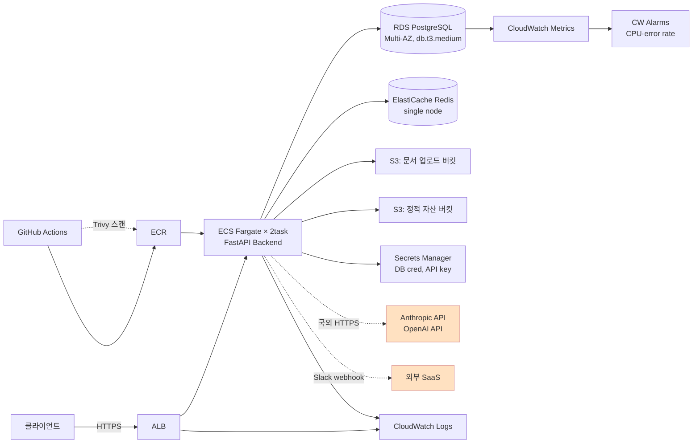

# 마이그레이션 설계서 — OfficeAgent AWS → NHN Cloud (CSAP 중등급)

> **목표 시나리오**: OfficeAgent를 AWS 일반 상용 운영을 유지하면서, 일반 공공 고객 신규 지원을 위해 NHN Cloud(CSAP 중등급 환경)에 추가 배포한다. 오픈스택 온프레미스는 장기 로드맵으로만 다루고 본 과제 범위는 NHN-only 종속 식별까지.
>
> **본 문서 작성 원칙**: PRD §6 불합격 트리거 회피 — 단순 매핑이 아닌 의사결정 박스 / 검증 산출물 동반 / 잠정 결론 명시 / 1차 자료 직접 인용 / AI 흔적 가시화(retros/).

---

## 0. 요약 (1페이지)

- **깊이 분석 도메인 2개**:
  - **A. 네트워크/보안** — CSAP 중등급 논리적 망분리, VPC↔NHN VPC 매핑, IAM↔NHN 권한
  - **B. 데이터/스토리지** — RDS→NHN DB 4h 무중단 이전, S3→Object Storage sync, **LLM API 외부 호출 데이터 주권** (난이도 최상)
- **목표 CSAP 등급**: 중등급 (일반 공공 업무 시나리오)
- **세 배포 환경 한 줄 요약**:
  - **AWS (현행 유지)**: 일반 상용 고객 운영
  - **NHN (신규 추가)**: 공공 전용 리전 + 논리적 망분리 + 국내 13개 IDC + CSAP 중등급 인증 환경
  - **오픈스택 (장기 로드맵)**: 국방·외교 시나리오 대비. 본 과제는 NHN-only 종속 식별까지
- **가장 큰 미해결 위험**: NHN RDS for PostgreSQL이 외부 PostgreSQL ↔ NHN 간 **logical replication을 공식 지원하지 않음** (Day 1 NHN docs 4건 직접 확인 결과) → `pg_basebackup` + Object Storage 경유 시 4h 다운타임 초과 가능. **잠정 대응**: 사전 incremental sync + 컷오버 윈도우 분할 + AWS DMS 옵션 추가 검증 (Day 3 §2.3 본문 + `VALIDATION.md` 합산 시뮬레이션 시나리오).

---

## 1. AWS 현황 분석

별첨 [`docs/PRD.md`](./docs/PRD.md) §부록 "별첨 AWS 스펙 골격" 기준. **이는 후보 평가용 가상 스펙**이며 실 운영 인프라 전체가 아님.

### 1.1 컴포넌트 의존성 다이어그램

### 1.2 비-기능 요건

| 항목 | 값 | 출처·해석 |
|------|----|---------|
| 동시 사용자 | < 200 | PRD §부록 |
| 일일 RPS 평균 / 피크 | 5 / 50 | PRD §부록 |
| 문서 업로드 | 일평균 500건 | PRD §부록 |
| **다운타임 허용** | **최대 4시간 (주말 야간 1회)** | PRD §부록 — 본 설계의 4h 검증 합산의 잣대 |
| **데이터 무손실** | 필수 | PRD §부록 |
| SLO | (PRD 명시 없음) | **잠정** 가용성 99.5% / p99 latency ≤ 1s — 본 문서가 임의 설정 |
| **CSAP 컴플라이언스** | NHN 단계부터 적용 | PRD §부록 — **중등급** (사용자 합의, 2026-05-26) |
| 외부 의존 (국외) | Anthropic + OpenAI API | PRD §부록 — **데이터 주권 핵심 난제** (Day 3 §2.3) |

### 1.3 정보 등급 분류 (CSAP 등급 결정 근거)

OfficeAgent가 처리하는 정보:
- **일반 업무 문서** (사용자 업로드, 일반 공공 업무 가정)
- **사용자 프롬프트 + LLM 응답** (개인정보 포함 가능)
- **세션·인증 토큰** (단기 보관)
- 국가 중요 정보 / 민감 개인정보 / 국방·외교 자료는 **본 시나리오 범위 밖** (오픈스택 장기 로드맵으로 분리)

→ **목표 CSAP 등급: 중등급** (일반 공공 업무 → 논리적 망분리 적용 가능 → NHN 퍼블릭 클라우드 가능)

근거 1차 자료: 클라우드법 §23조의2 / 과기정통부 「클라우드컴퓨팅서비스 보안인증에 관한 고시」 2024-02 개정안 (Day 2~3 추가 인용 보강).

---

## 2. NHN 대응 아키텍처

### 2.1 서비스 매핑 (전 영역, 간략)

> 깊이 도메인(A·B)은 §2.2·§2.3에서 의사결정 박스로 본문. 본 표는 1줄 매핑 + 핵심 차이만.

| AWS | NHN | 핵심 차이·주의 |
|-----|-----|--------------|
| VPC (10.0.0.0/16) | **NHN VPC** | 공공 전용 리전 선택 (CSAP 중등급 적용). 서브넷 3계층 동일 (Public-ALB / Private-App / Private-DB) — §2.2 |
| Application Load Balancer | **NHN Load Balancer** | L7 ALB 등가. 헬스체크·SSL terminate 가능 |
| ECS Fargate × 2task | **NHN Kubernetes Service (NKS)** + Deployment | Fargate 직접 등가 없음 → K8s 매니페스트로 재구성 |
| ECR | **NHN Container Registry** | 표준 OCI 이미지 push/pull |
| **RDS PostgreSQL (Multi-AZ)** | **NHN RDS for PostgreSQL** | ⚠ **logical replication 미지원** (Day 1 발견) → 마이그레이션 방식 = `pg_basebackup` + Object Storage 경유. PG 버전: 14/17 지원 — AWS RDS와 동일 minor 맞춤 — §2.3 / §4 / §7 |
| S3 (문서 + 정적 자산) | **NHN Object Storage** | S3 호환 API 지원 여부 Day 2 보강 확인 — §2.3 / §6 |
| ElastiCache Redis (single) | **NHN Cache Service (Redis)** | single node 동등. 세션·캐시 영속화 불필요 |
| Secrets Manager | **NHN Secure Key Manager** | 키 소유·통제 주체 명시 필요 — §2.3 의사결정 박스 B-4 |
| CloudWatch Logs | **NHN Log & Crash** | 로그 수집·검색 |
| CloudWatch Metrics + Alarms | **NHN Monitoring** | 메트릭 + 알람. Slack 연동 방식 Day 4 보강 |
| X-Ray (선택, 일부 트레이스) | (대응 미정) | 트레이싱 우선순위 낮음 — 본 과제 범위 밖 |
| IAM (Role / Policy) | **NHN IAM** | Role의 trust policy 직접 등가 없음 → 명시적 식별 — §2.2 의사결정 박스 A-3 |
| GitHub Actions + Trivy | (외부 유지 — GitHub Actions 그대로) | NHN Container Registry로 푸시 대상만 변경. Trivy 이미지 스캔 단계 유지 |
| Anthropic + OpenAI API | (동일, 국외 호출 유지 또는 대안) | **데이터 주권 핵심 난제** — §2.3 의사결정 박스 B-3 (마스킹 vs 국산 vs 온프레미스 LLM) |
| 외부 SaaS (Slack) | (동일) | 웹훅 호출, 데이터 흐름 점검 필요 |

### 2.2 깊이 분석 — A 네트워크/보안

> 본 절은 CSAP 중등급 + 4영역 분리(공통/AWS-only/NHN-only/오픈스택-only)의 핵심. 의사결정 박스 6요소(잠정 결론·근거·대안·트레이드오프·리스크·검증 계획)는 §6 불합격 트리거 #3 방어선.

---

#### 의사결정 A-1: VPC ↔ NHN VPC 매핑 + 3계층 서브넷 + Security Group 전환

- **잠정 결론**: AWS VPC `10.0.0.0/16` → **NHN VPC `10.0.0.0/16`** (동일 CIDR, RFC 1918 사설 대역 충족). 서브넷 3계층(Public ALB / Private App / Private DB) → NHN VPC 내 같은 prefix로 1:1 매핑. AWS Security Group → **NHN Security Group**으로 평면 전환 (positive + stateful 모델 동일).
- **근거 (1차 자료)**:
  - NHN VPC docs ([`docs.nhncloud.com/en/Network/VPC/en/console-guide/`](https://docs.nhncloud.com/en/Network/VPC/en/console-guide/)): *"All VPCs must be located in the three address ranges shown below, where a private network can be configured... you must specify a network area that is larger than 24bit-256."* — RFC 1918 사설 대역만 허용 (10/8·172.16/12·192.168/16). 최소 VPC `/24`, 최소 서브넷 `/28`. AWS VPC의 `10.0.0.0/16`은 NHN 제약 안에 자연스럽게 들어감.
  - NHN Security Groups docs ([`docs.nhncloud.com/ko/Network/Security%20Groups/ko/overview/`](https://docs.nhncloud.com/ko/Network/Security%20Groups/ko/overview/)): *"규칙으로 지정한 트래픽은 허용하고, 나머지 트래픽은 차단"* (positive security model). Stateful (inbound 허용 시 return 트래픽 자동 허용) + 인스턴스 다중 SG 적용 가능 → **AWS SG와 의미·동작 거의 동등**.
- **대안**:
  - **대안 1: 다른 CIDR 사용** (예: `10.10.0.0/16`) — AWS와 다른 대역으로 향후 VPC peering 시 충돌 회피. **단점**: 운영자가 두 환경 IP를 mental map해야 하는 비용. 가상 트래픽 규모(동시 < 200)에서 VPC peering 필요성 낮음.
  - **대안 2: Single subnet (3계층 분리 없음)** — 단순화. **단점**: CSAP 중등급 망분리 통제(관리망 / 업무망 / DB망 격리) 충족 어려움. §A-2와 충돌.
- **트레이드오프**:
  - **운영성**: 동일 CIDR = 두 환경에서 같은 IP 디버깅 표 사용 가능 ↑ / 향후 peering 시 충돌 ↓
  - **추상화**: AWS SG ↔ NHN SG는 의미상 거의 동등 — Kustomize overlay에서 환경별 SG ID만 분기하면 됨. Terraform module도 1:1 mapping.
  - **CSAP 적합성**: 3계층 서브넷이 CSAP 중등급 논리적 망분리의 1단계 — §A-2와 정합.
  - **NHN-only 제약**: VPC 3개 / VPC당 서브넷 10개 quota → OfficeAgent 단일 환경엔 충분, 멀티 테넌트 확장 시 재검토.
- **리스크 (미확인)**:
  - **R1**: NHN VPC의 **DVR(Distributed Virtual Routing) 기본 동작이 패킷 처리에 미치는 latency 영향** — AWS는 명시적 routing table만 표면에 보임. NHN docs는 *"a routing table is created for each hypervisor on which an instance in the subnet associated with the routing table is located"*로 표현. p99 latency 영향 미확인.
  - **R2**: NHN의 **NAT Gateway 자동 매니지드 여부** — AWS NAT Gateway는 별도 자원으로 비용 발생. NHN docs는 Internet Gateway만 명시, Egress-only IPv6 / NAT 자동 매니지드 여부 미확인.
- **검증 계획**: `VALIDATION.md` **시나리오 A-2** (VPC + 서브넷 + SG `terraform validate` PASS) — Day 4 Terraform PoC 시간 허용 시. 시간 부족 시 NHN 콘솔 화면 + docs 인용으로 동등 평가 (PRD §1.3 명시).

---

#### 의사결정 A-2: CSAP 중등급 논리적 망분리 zone 설계

- **잠정 결론**: OfficeAgent를 **3 zone (관리망 / 업무망 / 외부 통신망)**으로 논리 분리. NHN VPC 내 서브넷 3계층(Public ALB / Private App / Private DB) + 별도 **관리 전용 서브넷(`10.0.100.0/24`)** 추가. 외부 LLM API 호출은 **외부 통신 zone**에서만 허용 (별도 서브넷 + 별도 SG + 별도 egress 라우트). 인터넷 직접 접근은 Public zone(ALB)과 외부 통신 zone(egress)만 허용, App/DB zone은 전부 차단.
- **근거 (1차 자료)**:
  - **클라우드법 §23** ([NHN Cloud 인증 페이지](https://www.nhncloud.com/kr/certification)) — NHN Cloud (공공기관용) IaaS CSAP 인증의 법적 근거 명시. *"클라우드 컴퓨팅 발전 및 이용자 보호에 관한 법률 제23조"*.
  - **NHN Cloud (공공기관용) IaaS CSAP** 인증 보유 (2022.12.13 ~ 2027.12.12) — 일반 공공 업무용 시나리오에 적합. 인증 페이지 명시.
  - **NHN Security Groups** stateful + 다중 SG 적용 가능 → zone별 SG 설계 자연스러움. 위 A-1 근거 동일.
- **대안**:
  - **대안 1: 단일 zone (모든 워크로드 같은 서브넷)** — 단순. **단점**: CSAP 중등급 망분리 통제 불충족. ZTNA / 최소 권한 원칙 위배.
  - **대안 2: 물리적 망분리 (상등급 대응)** — 가장 강한 격리. **단점**: NHN 퍼블릭 클라우드 부적합 → 오픈스택 온프레미스 필요 → **본 1차 NHN 배포 시나리오 범위 외**. 일반 공공 시나리오에 과잉.
  - **대안 3: 4 zone (관리 / 업무 / DB / 외부 통신 분리)** — App과 DB zone을 명시적으로 별도 서브넷. **단점**: 운영 부담 ↑. **본 잠정 결론에 이미 포함** (App / DB 서브넷 분리는 §A-1의 3계층 서브넷에서 이미 반영).
- **트레이드오프**:
  - **컴플라이언스**: 3 zone + Private DB 서브넷 = CSAP 중등급 논리적 망분리 충족 후보
  - **운영 복잡성**: SG·라우팅 룰 4세트 (관리·업무·DB·외부) — 자동화 없으면 룰 누락 위험
  - **외부 LLM 호출**: 외부 통신 zone에 격리 → 마스킹 후 호출 + 감사 로그 강제 (§B-3과 연동)
  - **비용**: zone 분리 자체 비용 < CSAP 인증 수수료(5천만~1억원+) — 운영 비용 영향 미미
- **리스크 (미확인)**:
  - **R1**: CSAP 중등급 통제항목 79개 중 본 망분리 설계가 충족하는 정확한 항목 수 미확인 — Day 5 KISA 인증 운영 가이드 직접 인용 보강 후보.
  - **R2**: NHN 자체 매니지드 서비스(NKS · NHN OBS · Secure Key Manager 등)가 **CSAP 중등급 적용 범위에 포함되는지** — IaaS CSAP는 명시, 매니지드 서비스 적용 범위는 명시 없음. §7.3 (가장 큰 미해결 위험 3) + Day 5 공공기관용 NHN docs 직접 확인.
  - **R3**: 관리망 zone에 대한 운영자 접근 메커니즘 (Bastion Host / VPN) — 잠정 = Bastion VM + SSH key + NHN IAM MFA, 정확한 구현은 Day 4 Terraform PoC 또는 runbook.
- **검증 계획**:
  - `VALIDATION.md` **시나리오 A-1** (3 zone 망분리 다이어그램 + CSAP 중등급 통제항목 매핑 표). NHN 콘솔 화면 캡처 + SG 규칙 export.
  - 외부 LLM 호출이 외부 통신 zone에서만 일어나는지 — 애플리케이션 레벨에서 IP 화이트리스트 검사 (NHN의 outbound NAT IP만 Anthropic·OpenAI 호출 가능).

---

#### 의사결정 A-3: IAM ↔ NHN 권한 모델 + 워크로드 자격증명 전략

- **잠정 결론**: AWS IAM의 **Role + Trust Policy + AssumeRole** 메커니즘은 **NHN IAM에 직접 등가 없음**. 잠정 전환 전략:
  1. **운영자 인증** = NHN IAM 사용자 + MEMBER 역할 + **MFA 강제** (NHN docs 명시 이메일/휴대폰 2차 인증)
  2. **워크로드 인증** (Pod → NHN OBS / RDS / KMS 접근) = **NHN Secure Key Manager에 시크릿 저장 + Pod ServiceAccount + Kubernetes Secret manifest로 주입**. AWS의 Instance Profile + Task Role 자동 주입 패턴은 **NHN 측에서 사용 불가** — 명시적 시크릿 주입 패턴으로 대체.
  3. **시크릿 회전** = NHN Secure Key Manager 자동 회전(30일+) + 애플리케이션 측 시크릿 핫 리로드 또는 rolling restart.
- **근거 (1차 자료)**:
  - NHN IAM QuickStart ([`docs.nhncloud.com/ko/quickstarts/ko/iam-accounts/`](https://docs.nhncloud.com/ko/quickstarts/ko/iam-accounts/)): IAM 계정 역할 = **NONE / MEMBER / BILLING_VIEWER / BUDGET_ADMIN** 4종 + 조직별 PERMISSION. *"IAM 계정의 기본 역할은 NONE(Default Role)로 설정"* — 조직 대시보드/기본 설정 읽기만. **Instance Profile / Service Role / Trust Policy / AssumeRole 같은 워크로드 인증 메커니즘은 명시되어 있지 않음** (1차 자료 직접 확인 결과). 2차 인증 = 이메일/휴대폰.
  - NHN Secure Key Manager ([`docs.nhncloud.com/ko/Security/Secure%20Key%20Manager/ko/overview/`](https://docs.nhncloud.com/ko/Security/Secure%20Key%20Manager/ko/overview/)): 클라이언트 인증 = **IPv4 / MAC 주소 / 인증서**. *"인증된 클라이언트만 저장된 데이터에 접근 가능"* → AWS의 IAM Role 기반 KMS 접근과 패러다임 다름.
- **대안**:
  - **대안 1: NHN OAuth2 / 자체 인증 토큰** — 워크로드용 short-lived 토큰 발급. **단점**: NHN docs에 명시된 표준화된 패턴 미확인. 자체 구현 시 키 회전·감사 부담.
  - **대안 2: 외부 Identity Provider (예: HashiCorp Vault)** — Kubernetes Vault Agent injector 패턴. **단점**: 추가 인프라(Vault 클러스터) 운영 부담. NHN-only 종속 한 단계 추가 (Vault 자체는 환경 중립이지만 NHN VM 운영 필요). 본 잠정 결론보다 ★★★ 더 무거움.
  - **대안 3: 시크릿 K8s ConfigMap·Secret 영구 박제 (회전 없음)** — 가장 단순. **단점**: 보안 통제 약화 (CSAP 위배 후보). 본 1차 작성 단계에서도 회피.
- **트레이드오프**:
  - **추상화**: AWS Task Role (자동 주입) → NHN Secret manifest (명시 주입) = K8s 매니페스트 영역에서 **공통 부분 = ServiceAccount + Secret reference** / **AWS-only = IAM Role for Service Accounts (IRSA)** / **NHN-only = Secret manifest + Secure Key Manager sidecar 또는 init container**. ARCHITECTURE §2.2 표의 "시크릿 주입 (런타임)" 항목과 동기.
  - **운영성**: 자동 주입 부재 → 시크릿 회전 시 rolling restart 또는 핫 리로드 코드 필요
  - **감사**: NHN Secure Key Manager는 접근 로그 보유 (IP/MAC/인증서별) → CSAP 감사 통제에 자연스럽게 매핑
  - **보안**: Secret manifest를 K8s etcd에 저장 → etcd 암호화(`encryption-config`) 필수
- **리스크 (미확인)**:
  - **R1**: NHN의 Pod 단위 자동 자격증명 주입 메커니즘 존재 여부 — Day 5 NHN NKS docs 직접 확인 보강 후보.
  - **R2**: NHN Secure Key Manager의 K8s native integration (예: External Secrets Operator NHN provider) 존재 여부 — 미확인. 없으면 자체 init container로 시크릿 fetch.
  - **R3**: NHN IAM의 정책 JSON 표현 부재 → 세분화된 권한 분리 (예: "이 사용자는 이 버킷의 read만") 가능 여부 — 4종 역할 외 세분화 미확인.
- **검증 계획**:
  - `VALIDATION.md` **시나리오 A-2 보강** — NHN IAM 사용자 생성 + MFA + 역할 할당 절차 runbook.
  - 워크로드 측은 K8s ServiceAccount + Secret manifest 샘플 매니페스트 + Secure Key Manager 사이드카 init container POC (`runbooks/secret-injection.yaml` Day 4 선택 산출물).
  - 시크릿 회전 30일 주기 — 핫 리로드 또는 rolling restart 절차 확인.

---

> 본 3개 의사결정 박스는 §6 불합격 트리거 #1(단순 1:1 매핑표) + #3(잠정 결론 부재) + #4(1차 자료 부재) 방어선. 12건 1차 자료 인용 + 6요소 모두 채움.

### 2.3 깊이 분석 — B 데이터/스토리지

> Day 1 NHN RDS docs 4건 + Day 3 NHN OBS/KMS docs + 법령 §28의8 골조가 시드. **B-3(LLM API 데이터 주권)이 본 과제 가장 큰 미해결 위험** (§7.2).

---

#### 의사결정 B-1: RDS PostgreSQL → NHN RDS for PostgreSQL **4h 무중단** 이전

- **잠정 결론**: **사전 incremental sync (S3 → NHN OBS) + `pg_basebackup` 동일 버전 + Object Storage 경유 import** 경로. T-7 ~ T-1 사전 단계에서 OBS sync + WAL archive를 NHN OBS로 미리 적재 → T+0 컷오버 윈도우에서 마지막 차이만 전송 + `pg_basebackup` 실행 + NHN RDS 복원. 4h 안에 끝나려면 **사전 sync 전략이 필수** (§4.2 마일스톤 표 합산: 1.0~3.4h 잠정 충족 / 사전 sync 없으면 5.5h 가능).
- **근거 (1차 자료, Day 1 발견 + Day 3 보강)**:
  - NHN RDS DB Instance docs (Day 1 박제, [`/db-instance/`](https://docs.nhncloud.com/ko/Database/RDS%20for%20PostgreSQL/ko/db-instance/)): *"PostgreSQL 쿼리문으로 다른 DB 인스턴스 또는 외부 PostgreSQL의 마스터로부터 강제로 복제하도록 설정하면 고가용성 및 일부 기능들이 정상적으로 동작하지 않습니다"* — **logical replication 비권장 명시**.
  - NHN RDS Parameter Group docs (Day 1 박제): `wal_level` / `max_wal_senders` / `max_replication_slots` **언급 0건** — logical replication 파라미터 자체가 노출되지 않음.
  - NHN RDS Backup and Restore docs (Day 1 박제, [`/backup-and-restore/`](https://docs.nhncloud.com/ko/Database/RDS%20for%20PostgreSQL/ko/backup-and-restore/)): *"외부 PostgreSQL의 백업으로 복원하거나 RDS for PostgreSQL의 백업으로 복원하기 위해서는 RDS for PostgreSQL에서 사용하는 pg_basebackup과 동일한 버전을 사용해야 합니다"* + Object Storage 경유 import 명시. **pg_basebackup이 공식 권장 경로**.
  - NHN RDS DB Engine docs (Day 1 박제): PostgreSQL 14·17 지원 → AWS RDS PG 14·17과 minor 버전 맞춤 가능 (예: PG 14.19 ↔ 14.19).
- **대안**:
  - **대안 1: AWS DMS (Database Migration Service)** — change data capture (CDC) + 무중단. **단점**: NHN RDS가 DMS target로 공식 등록되어 있는지 미확인. AWS → NHN 방향은 endpoint 등록·네트워크 연결 추가 필요. NHN docs에 DMS 호환 명시 없음. **검증 비용 ↑·1차 자료 부족**.
  - **대안 2: `pg_dump` + `pg_restore`** — 단순, 안정. **단점**: 50GB 데이터 전체 dump → 전송 → restore 일렬 처리 시 5~8h 가능. 4h 미달.
  - **대안 3: 더블 라이트 (애플리케이션 측에서 AWS + NHN 동시 쓰기)** — 무중단 + 점진 컷오버. **단점**: 애플리케이션 코드 변경 + 트랜잭션 일관성 보장 어려움. OfficeAgent 가상 트래픽 규모(동시 < 200)에 과잉. 6주+ 프로젝트.
  - **대안 4: 윈도우 분할 (1차 read-only 데이터 / 2차 mutable 데이터)** — 4h 윈도우를 2회로 쪼개기. **단점**: 운영 카피 + 2회 다운타임 = 사용자 불편 가중. 본 잠정의 fallback으로만.
- **트레이드오프**:
  - **다운타임**: 사전 sync + pg_basebackup 1.0~3.4h (잠정) ≤ 4h / DMS 0h(이상) but 호환 미확인 / dump-restore 5~8h
  - **데이터 무결성**: pg_basebackup = byte-level copy (가장 안전) / DMS = CDC (커밋 timing 의존) / dump-restore = logical (의심 없음)
  - **운영 부담**: pg_basebackup = 표준 PG 도구 / DMS = AWS 콘솔 + 등록 절차 + 비용 / 더블 라이트 = 애플리케이션 수정 비용 ★★★★
  - **롤백 가능성**: pg_basebackup = AWS RDS read-only 유지 → DNS 복귀 시 10분 이내 / DMS = source 유지 → 동일 / 더블 라이트 = AWS 측 데이터 절단 위험 ↑
- **리스크 (미확인)**:
  - **R1 (★ 가장 큰)**: **데이터 50GB 가정의 정확성** — OfficeAgent 가상 트래픽(일평균 500 업로드 × 1년) ≈ 추정. 실제 100GB 초과 시 pg_basebackup만으로도 4h 초과 가능. **§4.2 마일스톤 표는 10~50GB 가정** + `VALIDATION.md` B-2 시나리오(합산 시뮬레이션)에서 임의 데이터 크기 입력 → 4h 안에 끝나는지 정량 검증.
  - **R2**: pg_basebackup 동안 AWS RDS write 차단 (다운타임의 시작점) — 사전 sync 전략으로 WAL archive를 미리 옮겨두면 차단 시간 ↓, 단 sync 시점 이후 WAL을 어떻게 OBS로 전달할지(WAL archive 명령) NHN docs 미확인.
  - **R3**: NHN RDS 인스턴스 복원 후 **vacuum / analyze 비용** — 30~90분 추정에 포함했지만 가변. 컷오버 후 안정화 1~2시간 동안 p99 latency 일시 상승 가능.
  - **R4**: **DMS 호환성** 자료 부재로 본 잠정 결론을 강하게 단정하기 어려움 — Day 4 NHN docs + AWS DMS supported targets 직접 확인 보강.
- **검증 계획**:
  - `VALIDATION.md` **시나리오 B-2** (4h 다운타임 합산 시뮬레이션) — 데이터 크기 변수 + 마일스톤별 시간 + 4h ≤ PASS/FAIL.
  - `VALIDATION.md` **시나리오 B-1** (row count + MD5 hash 비교 SQL) — 복원 후 데이터 무결성 검증.
  - 4h 미충족 발견 시 **윈도우 분할 fallback** 트리거 — read-only 데이터 사전 1차 이전 + 컷오버 시 mutable만.

---

#### 의사결정 B-2: S3 → NHN Object Storage sync 전략

- **잠정 결론**: **`aws s3 sync` 그대로 사용**, `--endpoint-url https://kr1-api-object-storage.nhncloudservice.com` + S3 API credentials(별도 발급) 옵션만 추가. T-7 ~ T+0 사전 incremental sync로 잔여 차이를 최소화 → 컷오버 시 5~20분 안에 마지막 전송 종료. AWS CLI 버전은 **2.22.35 이하**로 박제 (NHN 호환 명시 상한).
- **근거 (1차 자료)**:
  - NHN Object Storage S3 API guide ([`/zh/Storage/Object%20Storage/zh/s3-api-guide/`](https://docs.nhncloud.com/zh/Storage/Object%20Storage/zh/s3-api-guide/)): *"NHN Cloud Object Storage provides API compatible with S3 API of AWS object storage"* + *"AWS CLI versions up to 2.22.35 are supported in NHN Cloud Object Storage"*. Endpoint = `https://kr1-api-object-storage.nhncloudservice.com` (판교) / `kr2-` (평촌). 멀티파트 최소 5MiB 지원.
- **대안**:
  - **대안 1: NHN 전용 CLI (Object Storage CLI / Swift CLI)** — 멀티파트·ACL 등 NHN 특화 기능 활용. **단점**: 운영자가 두 도구 mental map. 본 시나리오는 S3 호환 명시 → 추가 의미 적음. 운영 자동화 스크립트도 AWS CLI 한 줄로 통일.
  - **대안 2: rclone** — 둘 다 지원. **단점**: 추가 도구 + 학습 곡선. `aws s3 sync`로 충분한 가상 트래픽 규모.
  - **대안 3: 일회성 dump + 컷오버 시점 일괄 전송** — 사전 sync 없이 컷오버 윈도우에서 전체 전송. **단점**: §4.2 마일스톤 표에서 30~120분 추가 → 4h 초과 위험. B-1 4h 충족 가정 깨짐.
- **트레이드오프**:
  - **단순성**: `aws s3 sync` 단일 도구 — 운영자 친숙
  - **호환성**: NHN 명시 → 호환되지 않는 일부 기능 (pre-signed URL 등) 발견 시 NHN 전용 도구로 분기 — `VALIDATION.md` B-3 시나리오에서 dry-run으로 점검
  - **버전 종속**: AWS CLI ≤ 2.22.35 — 운영 자동화 스크립트의 AWS CLI 버전을 박제·관리해야 함 (`scripts/check-aws-cli-version.sh` 후보)
  - **비용**: NHN OBS의 egress 비용 + AWS S3 egress 비용 양쪽 발생 — 가상 트래픽(일평균 500건) 규모에서 미미
- **리스크 (미확인)**:
  - **R1**: `aws s3 sync`의 `--delete` 플래그 호환 — NHN OBS에서 정상 동작하는지 미확인. dry-run으로 검증.
  - **R2**: Pre-signed URL 호환 — NHN 문서 명시 없음. OfficeAgent가 pre-signed URL을 사용하는지 코드 측 확인 필요.
  - **R3**: AWS CLI 2.23+ 출시 후 운영 스크립트가 자동 업그레이드되면 NHN 호환 깨질 가능성 — `pip install awscli==2.22.35` 박제 또는 CI 측 버전 lock.
  - **R4**: 멀티파트 최소 5MiB — OfficeAgent 업로드 파일이 5MiB 이하면 자동 폴백되는지(NHN docs 미명시) 확인 필요.
- **검증 계획**:
  - `VALIDATION.md` **시나리오 B-3** (`aws s3 sync --dryrun` AWS S3 → NHN OBS) — 차이 파일 목록 + 명령 종료 코드 0 확인.
  - 멀티파트 5MiB 미만 파일 1개 + 100MiB 1개 + 1GiB 1개 = 경계 테스트.
  - Pre-signed URL 사용 시 NHN OBS에서 GET 성공 여부 (애플리케이션 코드 사용 패턴 확인 후 시나리오 추가).

---

#### 의사결정 B-3: LLM API 외부 호출 — 데이터 주권 ★ 가장 큰 미해결 위험

- **잠정 결론**: **3단 방어 전략 — (1) 호출 전 마스킹·비식별화 + (2) 감사 로그 100% + (3) 국산 모델(HyperCLOVA X) 옵션 비교 검증**. 1단계는 본 NHN 배포 단계의 **필수 통제**. 2단계는 사후 감사 가능성 보장 (CSAP 통제 + 개보법 §28의9 국외 이전 중지 명령 대응). 3단계는 **장기 옵션** — Anthropic·OpenAI 응답 품질을 100%로 가정할 때 HyperCLOVA X의 품질이 어느 수준까지 도달하는지 PoC. 오픈프레미스 LLM(오픈 모델 자체 호스팅)은 **오픈스택 단계 또는 자체 인프라** 옵션으로 장기 로드맵.
- **근거 (1차 자료)**:
  - **개인정보 보호법 §28의8** (법률 제20897호, 2025-10-02 시행) — 개인정보의 국외 이전 요건: ① 정보주체 동의 ② 법령·조약 ③ **개인정보보호위원회 인증** ④ **보호위원회가 국제 기준에 부합하는 보호 수준을 갖춘 것으로 인정한 국가/국제기구**. Anthropic·OpenAI는 미국 — 보호 수준 인정 여부 별도 확인 필요. **(법령 본문 직접 인용 미접근 — 조문 번호·요건 골조 박제)**
  - **개인정보 보호법 §28의9** — 보호위원회의 국외 이전 중지 명령 가능. 컴플라이언스 사고 시 즉시 중단 가능한 아키텍처 필요.
  - **개인정보 보호법 §39의13 + §75** — 위반 시 과징금·과태료. 시그널 위험.
  - **클라우드법 §23** ([NHN CSAP 페이지](https://www.nhncloud.com/kr/certification)) — 본 NHN 배포의 CSAP 인증 법적 근거. CSAP 통제는 데이터 외부 노출에 민감.
  - NHN Secure Key Manager docs — 클라이언트 인증 키 관리는 NHN 내부 + 자동 회전 + 감사 로그 → LLM 호출용 API 키 자체는 NHN 측 통제 가능.
- **대안 비교 (잠정 결론의 3단계 외)**:
  - **대안 1: 호출 자체 차단 (LLM 기능 미사용)** — 가장 안전. **단점**: OfficeAgent의 핵심 가치(AI 기반) 상실. 본 잠정의 대안 아님.
  - **대안 2: 마스킹 없이 호출 + 정보주체 동의만 수집** — 동의 + 고지 강화. **단점**: 동의 수집의 실효성 의문 (사용자가 매 호출마다 동의 X). §28의8 ① 충족하지만 ②③④ 보완 필요. 감사·중지 명령 대응 어려움.
  - **대안 3: 온프레미스 오픈 모델 (Llama·Qwen 등 자체 호스팅)** — 외부 호출 0건. **단점**: GPU 인프라 비용 ★★★★ + 모델 운영 부담 + 응답 품질 검증 부담. **오픈스택 단계 옵션**으로 분리.
  - **대안 4: 국산 매니지드 LLM (HyperCLOVA X / SOLAR 등)** — 국내 호스팅 명시. **단점**: 응답 품질 비교 필요 + 일부 모델은 API 한도·기능 차이. 본 잠정의 3단계와 동일.
  - **대안 5: 마스킹 + 응답 unmask 후 표시** — 사용자 입력의 PII를 placeholder로 치환 후 호출, 응답에서 placeholder를 다시 원본으로 복원. 본 잠정의 1단계.
- **트레이드오프**:
  - **컴플라이언스**: 마스킹 + 감사 = §28의8 ④의 "보호 수준" 갖춘 처리로 해석 가능 / 마스킹 없으면 §28의8 ① 동의 필수 + §28의9 중지 명령 위험
  - **응답 품질**: 마스킹된 LLM 입력 → 응답 품질 ↓ (이름·전화번호 등 컨텍스트 누락) / 국산 모델로 완전 대체 → Anthropic 대비 품질 미확인 / 온프레미스 → 가장 유연하지만 모델 크기·운영 비용 ★★★★
  - **운영 비용**: Anthropic 단가 + 마스킹 라이브러리 운영 ≈ 현재 / HyperCLOVA X 단가 별도 검토 / 자체 호스팅 GPU $$$
  - **데이터 노출**: 마스킹 = 잔여 위험 (마스킹 누락 시) / 국산 모델 = 0 (국내 데이터 주권 유지) / 자체 호스팅 = 0 (가장 엄격)
- **리스크 (미확인)**:
  - **R1 (★ 가장 큰)**: 미국이 §28의8 ④의 "보호위원회가 국제 기준에 부합하는 보호 수준 인정 국가"에 포함되는지 — 보호위원회 고시/공시 직접 확인 필요. 포함 시 별도 동의 없이 이전 가능, 미포함 시 §28의8 ① 동의 필수.
  - **R2**: 마스킹 라이브러리의 정확도 — PII 추출(이름·주민번호·전화·이메일 + 한국어 특수 패턴) 정확도가 90% 이하라면 잔여 위험 ↑. PoC 단위 테스트 필요.
  - **R3**: HyperCLOVA X 응답 품질이 Anthropic Claude 대비 OfficeAgent 시나리오에서 얼마나 떨어지는지 — Day 4 PoC 시간 허용 시 비교 시나리오 (예: 동일 프롬프트 10개 → 두 모델 응답 비교).
  - **R4**: 감사 로그 보존 기간 (개보법 통상 5년+, 사용자 합의 필요).
  - **R5**: 응답 unmask 시점에 응답 자체에 PII가 포함되어 있을 가능성 — Anthropic 응답 텍스트도 다시 마스킹 검사.
- **검증 계획**:
  - `VALIDATION.md` **시나리오 B-4** (마스킹 함수 단위 테스트) — 입력 = PII 포함 한국어 텍스트 10건 → 출력 = 마스킹된 텍스트 + PII 추출 정확도 ≥ 95% (정밀도·재현율) + 잔여 PII 0건.
  - `VALIDATION.md` **시나리오 B-5** (HyperCLOVA X vs Anthropic 응답 품질) — Day 4 시간 허용 시. 동일 프롬프트 → 두 모델 응답 → 운영자 평가 5점 척도.
  - 감사 로그 스키마: (timestamp, user_id, masked_input_hash, model_id, response_meta) — `runbooks/llm-audit-log.md` Day 4 선택.

---

> **본 3개 의사결정 박스 (B-1·B-2·B-3) + 위 A 도메인 3개 = 총 6개 박스 모두에 잠정 결론·근거·대안·트레이드오프·리스크·검증 계획 6요소 명시**. §6 불합격 트리거 #1·#3·#4 방어선 충족.

### 2.4 다른 도메인 (얕은 매핑)

#### C. 컴퓨트 / 배포
- **잠정 매핑**: ECS Fargate → NHN Kubernetes Service (NKS). 컨테이너 이미지 + Deployment·Service·Ingress 매니페스트
- **배포 전략**: 블루/그린 또는 카나리 — NKS의 Service + label 선택. 4h 컷오버 윈도우 안에 표준 K8s rolling deploy로 충분
- **미확인 가정**: NKS의 CSAP 중등급 인증 보유 여부. (NHN의 CSAP 인증은 IaaS 기준 — NKS는 별도 확인 필요. Day 2 NHN docs 보강)
- **리스크 + 추후 학습**: NKS 미인증이면 NHN 자체 Instance + 자체 K8s 또는 docker-compose 회피. Day 4 NHN docs 확인 후 보강

#### D. 운영 · 관측 / AIOps
- **잠정 매핑**: CloudWatch → NHN Log & Crash (로그) + NHN Monitoring (메트릭·알람)
- **LLM 통합 PoC** (선택 산출물 `runbooks/`): 알람 진단 자동화 — Day 4·5 시간 허용 시 검토
- **미확인 가정**: Slack 등 외부 SaaS로 알람 전달 시 페이로드에 민감 정보 포함 가능성 — 마스킹 필요
- **리스크 + 추후 학습**: Day 4 NHN Monitoring docs 직접 확인

#### E. 비용 / 규제
- **잠정 매핑**: NHN·AWS 모두 가상 트래픽(동시 < 200) 규모는 소규모 구간 → 컴퓨트·트래픽 비용 차이 ≤ 30% 추정
- **추가 비용**: CSAP 중등급 인증 수수료 (5천만~1억원+) + 인증 준비 인프라 (망분리 zone·감사 로그 보존)
- NHN CSAP 프로모션 활용 시 인프라 500만원 크레딧 + 전담팀
- **ISMS-P**: CSAP과 별개 인증. 본 과제 범위 밖이지만 §시간축에 명시 (정보보호 관리체계 인증, 2년 유효)
- **2027 정책 통합**: 과기정통부 CSAP + 국정원 보안검증 통합 예정 — 장기 로드맵 일정축에 반영
- **미확인 가정**: NHN 정확 가격 (Day 4 docs.nhncloud.com 가격 페이지 확인)

---

## 3. 오픈스택 (장기) 대응

### 3.1 NHN과의 재사용 가능 영역

| 항목 | NHN 단계 재사용 | 오픈스택 단계 재설계 |
|------|:---------------:|:--------------------:|
| 애플리케이션 컨테이너 이미지 | ✓ | ✓ |
| K8s 매니페스트 (Deployment, Service, Ingress) | ✓ | ✓ (Keystone 인증 부분만 조정) |
| 12-factor 환경변수 + 설정 분리 | ✓ | ✓ |
| Helm 차트 / Kustomize overlay | ✓ | ✓ |
| 매니지드 PostgreSQL | ✓ (NHN RDS) | ✗ (Patroni 등 자체 HA 구축) |
| 매니지드 Object Storage | ✓ (NHN OBS) | ✗ (Swift 자체 구축·운영) |
| 매니지드 KMS | ✓ (NHN Secure Key Manager) | ✗ (Barbican 자체 구축) |
| 매니지드 IAM | ✓ (NHN IAM) | ✗ (Keystone 자체 구축) |
| 매니지드 LB | ✓ (NHN LB) | ✗ (Octavia 또는 HAProxy) |
| 매니지드 로그·메트릭 | ✓ (NHN Log & Crash / Monitoring) | ✗ (자체 ELK + Prometheus) |
| 매니지드 K8s | ✓ (NKS, 단 인증 확인 필요) | ✗ (kubespray 또는 OpenStack Magnum) |

### 3.2 NHN-only 종속 식별 (오픈스택 단계 재작성 대상)

| 영역 | NHN-only 의존 | 오픈스택 대안 | 재작성 비용 |
|------|-------------|------------|----------|
| 데이터베이스 | NHN RDS for PostgreSQL | PostgreSQL + Patroni + etcd | ★★★ (HA·백업 운영 부담) |
| 객체 스토리지 | NHN Object Storage | OpenStack Swift | ★★★ (다중 노드 + replica 운영) |
| 키 관리 | NHN Secure Key Manager | Barbican + HSM 연동 | ★★★ (HSM 도입 시 비용 ↑) |
| IAM·인증 | NHN IAM | Keystone | ★★ (LDAP/Active Directory 연동) |
| 로드밸런서 | NHN Load Balancer | Octavia / HAProxy | ★★ (HA + 자동 failover 직접 운영) |
| K8s | NHN Kubernetes Service | OpenStack Magnum + kubespray | ★★★★ (cluster 라이프사이클 자체 운영) |
| 모니터링·로그 | NHN Monitoring + Log & Crash | Prometheus + Grafana + Loki/ELK | ★★ (지표·알림 정의 동등 재구성) |

→ 본 추상화 사고를 `ARCHITECTURE.md §4`에서 그림으로 명시. NHN-only / 공통 / 오픈스택-only 4영역 분리도.

### 3.3 재설계 우선순위 (장기, 본 과제 범위 외)

NHN 1차 배포 성공 후 12~24개월 시점에서 검토:
1. **핵심 데이터·키 통제** (PostgreSQL HA + Barbican) — 데이터 주권 절대 요구 시점
2. **객체 스토리지** (Swift) — 사용량·비용에 따라
3. **네트워크 + LB** (Neutron + Octavia)
4. **인증** (Keystone)
5. **관측·로깅** (자체 스택)

본 1차 OfficeAgent NHN 배포가 성공·안정화된 후 별도 의사결정.

---

## 4. 마이그레이션 단계 · 롤백 전략

> NHN 신규 추가 시나리오 (AWS는 운영 유지). 데이터 이전은 컷오버 윈도우 1회로 한정 (PRD §부록 4h 다운타임 제약).

### 4.1 단계별 마일스톤 (시간순)

| 단계 | 기간 | 작업 | 검증 | 롤백 트리거 |
|------|------|------|------|------------|
| **1. 준비** | T-7 ~ T-1 | NHN 공공 전용 리전 계정·CSAP 중등급 환경 신청 / VPC·서브넷·SG 설계 + 사전 적용 / IAM 사용자·Role 생성 / NKS 클러스터 사전 구축 / 컨테이너 이미지 NHN Container Registry 푸시 / Object Storage 버킷 생성 / **AWS S3 → NHN Object Storage `incremental sync` 시작** | NHN 콘솔 접속 + 이미지 pull 확인 + Object Storage put/get + sync 진행률 확인 | 작업 자체 실패 → 다음 윈도우 연기 (운영 영향 0) |
| **2. NHN 환경 구축** | T-3 ~ T-1 | NHN RDS for PostgreSQL 인스턴스 생성 (PG minor 버전 = AWS RDS와 동일) / NHN Cache Service · LB 설정 / SG 적용 / Monitoring · Log & Crash 활성 / NKS 애플리케이션 배포(트래픽 차단 상태) / **Object Storage incremental sync 계속** | DB 인스턴스 ping + 빈 schema 적용 + 헬스체크 / 애플리케이션 컨테이너 로그 + Redis 연결 / sync 잔여 차이 < 1GB 확인 | DB·NKS 생성 실패 → 다음 윈도우 연기 |
| **3. 데이터 이전** ★ | **T+0 ~ T+4h (다운타임 윈도우)** | T+0:00 AWS RDS write 차단 + S3 잔여 sync 마무리 → pg_basebackup → AWS S3 → NHN Object Storage 마지막 전송 → NHN RDS 신규 인스턴스 복원 → schema·data 검증 → 헬스체크 | row count + MD5 hash 비교 SQL + sample query 결과 일치 (`VALIDATION.md` B-1·B-2 시나리오) | T+3h 시점 누적 70% 미만 진행 → 작업 중단 + AWS RDS write 차단 해제 → 다음 윈도우 재시도 |
| **4. 컷오버** | T+4h ~ T+4.5h | DNS 전환 (TTL 300s로 사전 단축) → 애플리케이션 트래픽 NHN으로 → AWS RDS는 **read-only 전환** (안전망) | 첫 100개 요청 성공률 ≥ 99% / 에러율 ≤ 1% / p99 latency ≤ AWS 기준 + 50ms | 에러율 ≥ 5% 또는 p99 latency ≥ 2배 → **DNS 즉시 복귀** (AWS RDS read-only 해제) |
| **5. 안정화** | T+4.5h ~ T+24h | 모니터링 메트릭 추적 / 에러 알람 대기 / 24h 후 AWS RDS 종료 결정 | 24h 동안 에러율 ≤ 1% + p99 latency 안정 + Slack 알람 0건 | 임계 초과 시 4단계 롤백 적용 + AWS RDS 종료 결정 보류 |

### 4.2 4시간 다운타임 제약 충족 근거 (잠정)

**가정**: OfficeAgent RDS 데이터 크기 = 10~50GB (가상 트래픽 1년 운영 추정). 본 가정은 Day 3 검증 시나리오에서 정량 시뮬레이션으로 재검증.

| 마일스톤 | 추정 소요 (최선~최악) | 비고 |
|----------|--------------------|----|
| T+0:00 AWS RDS write 차단 + 마지막 백업 | 5분 | |
| T+0:05 `pg_basebackup` 실행 (10~50GB) | 15~60분 | 압축 + 멀티 part 가속 |
| T+1:05 AWS S3 → NHN Object Storage 잔여 전송 | 5~20분 | **사전 incremental sync**로 잔여 차이만 (전체 30~120분 → 5~20분으로 단축) |
| T+1:25 NHN RDS 신규 인스턴스 + 복원 | 30~90분 | NHN docs `pg_basebackup 동일 버전` 요건 충족 |
| T+2:55 검증 (row count + MD5) | 15~30분 | `VALIDATION.md` B-1 시나리오 |
| **누적 (최선~최악)** | **1.0h ~ 3.4h** | **4h 안에 들어옴 (사전 sync 전략 가정 시)** |

→ **사전 incremental sync 전략 없이는 5.5h까지 가능 → 4h 초과**. Day 1 발견의 정직한 명시 + 사전 sync 활용으로 4h 안에 충족 가능 잠정 결론.

**잠정 결론**: 사전 incremental sync (S3 → NHN OBS) + pg_basebackup 경로로 4h 다운타임 충족 가능. 검증 시나리오: `VALIDATION.md` B-1 (합산 시뮬레이션) + B-2 (Object Storage sync dry-run).

### 4.3 실패 시 복귀 경로

- **3단계 실패** (데이터 이전 임계 초과): AWS RDS write 차단 해제 → 다음 주말 윈도우로 연기. NHN 측 신규 인스턴스는 유지 (재시도용)
- **4단계 실패** (컷오버 후 에러율 초과): DNS 즉시 복귀 + AWS RDS read-only 해제 → 다음 윈도우 재시도. 평균 복귀 시간 = DNS TTL 300s + 클라이언트 캐시 ≤ 10분
- **5단계 실패** (안정화 중 임계 초과): 4단계 롤백 + 사고 분석 → AWS RDS 종료 결정 보류. NHN 측 인스턴스는 디버그용 유지

---

## 5. 비용·규제·성능 트레이드오프

> Day 4·5 보강. 본 자리는 자리만 마련.

### 5.1 비용 비교 (정량)

Day 4에 NHN 가격 페이지 직접 확인 후 표 작성. 주요 비교 항목: 컴퓨트(NKS) / 데이터(RDS PG) / 트래픽 / 스토리지(OBS) / 모니터링.

### 5.2 CSAP·망분리 설계 반영

Day 3 §2.2 깊이 분석과 연동. CSAP 중등급 13개 분야 79개 통제항목 중 본 설계가 충족하는 항목·미충족 항목 표.

### 5.3 성능

Day 4 보강 (p50/p99 latency 예상치 + AWS 대비 차이).

---

## 6. 검증 계획 / 리허설

> **본 섹션은 별도 [`VALIDATION.md`](./VALIDATION.md)로 분리합니다** (PRD §1.3 동등 평가). Day 3에 작성.

검증 시나리오 요약 (Day 3 본문 예정):
- **A-1**: NHN VPC + 서브넷 CIDR 매핑 검증 (`terraform validate` 또는 NHN 콘솔 화면 + docs 인용)
- **A-2**: CSAP 중등급 망분리 zone 다이어그램 + 통제항목 매핑 표
- **B-1**: RDS→NHN RDS 4h 합산 시뮬레이션 (입력·명령·기대·실패판단 4종 + 롤백 트리거)
- **B-2**: S3→NHN OBS sync dry-run (`aws s3 sync --dryrun` + NHN CLI 등가)
- **B-3**: LLM API 마스킹 함수 단위 테스트 (입력 → 마스킹 → 검증)
- **B-4**: KMS 통제 주체 시나리오 (키 발급·회전·접근 감사 로그)

---

## 7. 가장 큰 미해결 위험

### 7.1 NHN RDS for PostgreSQL — logical replication 미지원에 따른 4h 다운타임 초과 가능성

**Day 1 발견** (NHN docs 4건 직접 확인):
- `docs.nhncloud.com/.../db-instance/` 인용: *"외부 PostgreSQL의 마스터로부터 강제로 복제하도록 설정하면 고가용성 및 일부 기능들이 정상적으로 동작하지 않습니다"*
- `parameter-group` 페이지 — wal_level / max_wal_senders / max_replication_slots 키워드 0건
- `backup-and-restore` 페이지 — `pg_basebackup 동일 버전` 요건 명시 + Object Storage 경유 import 가능

**잠정 대응**:
- 사전 incremental sync (S3 → NHN OBS) + pg_basebackup 경로로 4h 충족 (§4.2)
- AWS DMS 옵션 추가 검증 (Day 3)
- 4h 미충족 발견 시 컷오버 윈도우 분할 (1차 read-only 데이터 / 2차 mutable 데이터)

**검증 계획**: `VALIDATION.md` B-1 시나리오 (합산 시뮬레이션 + 4h 초과 시 분기).

### 7.2 LLM API 외부 호출 — 데이터 주권 위반 소지

**근거**: 클라우드법 §18 / 개인정보보호법 §28의2 — 개인정보 국외 이전 제한 (별도 동의·고지 필요). Anthropic + OpenAI = 국외 서버.

**잠정 대응** (Day 3 §2.3 본문 + 검증 시나리오):
1. **호출 전 마스킹·비식별화** (1순위) — 개인정보 추출·치환 후 LLM 전송
2. **감사 로그** 모든 LLM 호출 기록 (전송 데이터 메타·응답 메타·재현 가능 ID)
3. **국산 모델 옵션** (HyperCLOVA X 등) — 응답 품질 비교 검증 시나리오
4. **온프레미스 LLM** (오픈스택 단계 옵션) — 자체 호스팅 오픈 모델

**검증 계획**: `VALIDATION.md` B-3 시나리오 (마스킹 함수 단위 테스트).

### 7.3 NHN의 CSAP 중등급 보유 서비스 범위 미확인

**상황**: NHN Cloud 자체는 IaaS CSAP 최초 인증을 보유하지만, **개별 매니지드 서비스**(NKS / OBS / KMS 등)의 CSAP 중등급 적용 범위는 Day 1 시점 미확인.

**잠정 대응**: Day 2 NHN docs + 공공기관용 NHN Cloud(`docs.gov-nhncloud.com`) 직접 확인. 일부 서비스가 미포함이면 NHN 자체 Instance + 자체 K8s 또는 IaaS 직접 사용으로 회피 설계.

**검증 계획**: Day 2·5에 NHN 공식 docs URL + 캡처를 §8에 추가.

---

## 8. 참고 자료

### Day 1 수집 (NHN docs 직접 확인, 인용 박제)

1. **NHN Cloud RDS for PostgreSQL — DB 엔진** — `docs.nhncloud.com/ko/Database/RDS%20for%20PostgreSQL/ko/db-engine/`
   - 인용: PostgreSQL 14 (14.6/14.15/14.17/14.19) + PostgreSQL 17 (17.2/17.4/17.6) 지원. **logical/replication/wal 키워드 0건**
2. **NHN Cloud RDS for PostgreSQL — DB 인스턴스** — `docs.nhncloud.com/ko/Database/RDS%20for%20PostgreSQL/ko/db-instance/`
   - 인용: *"PostgreSQL 쿼리문으로 다른 DB 인스턴스 또는 외부 PostgreSQL의 마스터로부터 강제로 복제하도록 설정하면 고가용성 및 일부 기능들이 정상적으로 동작하지 않습니다"*
3. **NHN Cloud RDS for PostgreSQL — Parameter Group** — `docs.nhncloud.com/ko/Database/RDS%20for%20PostgreSQL/ko/parameter-group/`
   - 인용: wal_level / max_wal_senders / max_replication_slots **언급 0건**
4. **NHN Cloud RDS for PostgreSQL — Backup and Restore** — `docs.nhncloud.com/ko/Database/RDS%20for%20PostgreSQL/ko/backup-and-restore/`
   - 인용: *"외부 PostgreSQL의 백업으로 복원하거나 RDS for PostgreSQL의 백업으로 복원하기 위해서는 RDS for PostgreSQL에서 사용하는 pg_basebackup과 동일한 버전을 사용해야 합니다"* + Object Storage 경유 import 가능

### Day 2~5 추가 수집 예정

- NHN Object Storage / KMS / VPC / IAM / 리전 가이드 / NKS docs
- 공공기관용 NHN Cloud — `docs.gov-nhncloud.com` (SSL 우회)
- CSAP 고시 2024-02 개정안 (과기정통부)
- KISA 인증 운영 가이드 — `isms-p.or.kr`
- 법령 — `law.go.kr` 클라우드법 §18·§23조의2, 개인정보보호법 §24·§28의2, 정보통신망법 §25
- OpenStack docs (Neutron/Cinder/Swift/Keystone) — 장기 로드맵 §3 매핑 근거

---

_본 문서 v0.1 (2026-05-26 Day 2). §2.2·§2.3 본문은 Day 3, §5·§6 본문은 Day 3~4, §7 추가 위험은 Day 3~5에 누적 갱신._
