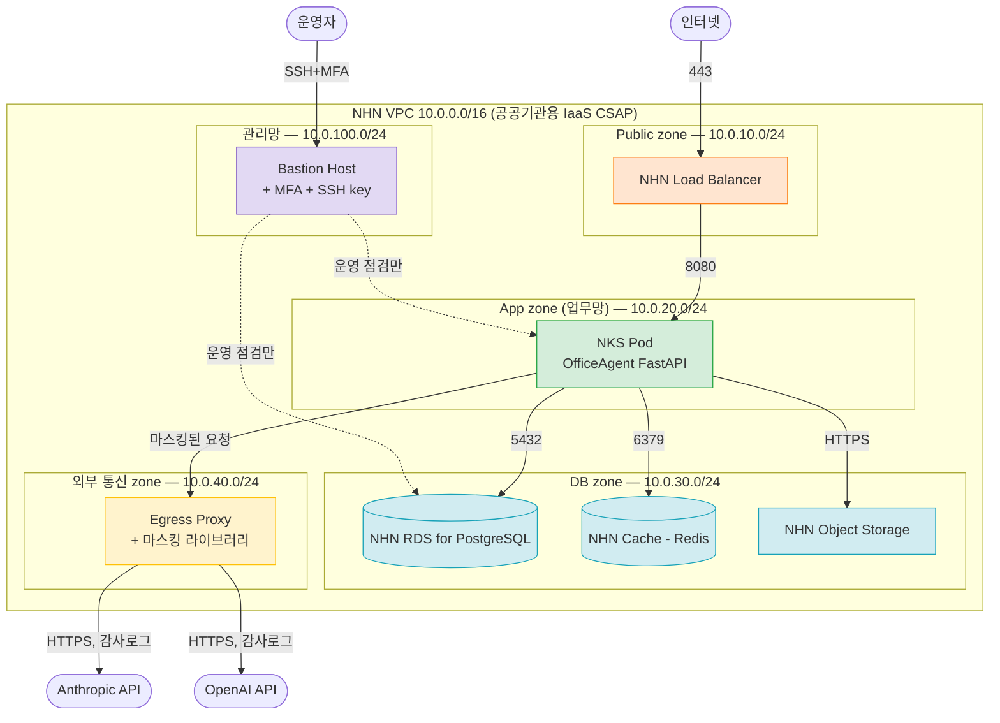

# 검증 산출물 — OfficeAgent AWS → NHN Cloud 마이그레이션

> **본 문서의 목적**: PRD §1.3 "검증 산출물"의 §6 불합격 트리거 #2 방어선. 각 시나리오는 **입력 / 명령 / 기대 출력 / 실패 시 판단 기준** 4종 + **롤백 트리거 + 복귀 경로**를 명시한다.
>
> **재현성**: 클라우드 계정 없음 (PRD §3) → 본 시나리오는 placeholder + dry-run 위주. 실제 운영 환경에서는 placeholder만 교체 후 실행 가능한 수준의 구체성을 목표.
>
> **연관**: [`MIGRATION_PLAN.md §2.2·§2.3`](./MIGRATION_PLAN.md#22-깊이-분석--a-네트워크보안) 의사결정 박스 6개의 "검증 계획" 필드와 1:1 대응.

---

## 0. 검증 산출물 개요

| 도메인 | 시나리오 수 | 시나리오 ID | 형태 |
|--------|----------:|----------|------|
| **A 네트워크/보안** | 2 | A-1, A-2 | mermaid 다이어그램 + CSAP 통제항목 매핑 / `terraform validate` + 콘솔 캡처 |
| **B 데이터/스토리지** | 3 | B-1, B-2, B-3 | row count + MD5 hash SQL / 4h 다운타임 합산 시뮬레이션 / `aws s3 sync --dryrun` |
| **B 보강 (선택)** | 2 | B-4, B-5 | 마스킹 함수 단위 테스트 / HyperCLOVA X 응답 품질 비교 |

깊이 도메인 각각 최소 2개 이상 (PRD §1.3 도메인당 ≥1 충족 + 1개 더).

본 7개 시나리오 모두 **4시간 다운타임 제약**과 직접 또는 간접 연결됨.

---

## 1. 도메인 A — 네트워크/보안 검증 시나리오

### 1.1 시나리오 A-1: CSAP 중등급 망분리 3 zone 다이어그램 + 통제항목 매핑

**목적**: OfficeAgent NHN 배포의 망분리 설계가 CSAP 중등급 통제항목 중 어느 항목을 충족·미충족하는지 명시. 매핑 표 자체가 검증 산출물 (PRD §1.3 *"형태 자유"* 명시).

**언제 실행**: 본 문서 작성 시점에 1회 (정적 산출물). 실 운영 환경에서는 CSAP 인증 갱신 주기(5년)마다 재검증.

**4h 다운타임 제약과의 연결**: 망분리 설계는 사전 단계(T-7) 작업 — 컷오버 윈도우 안에 들어오지 않음.

**입력**
- [MIGRATION_PLAN.md §2.2 의사결정 박스 A-2 잠정 결론](./MIGRATION_PLAN.md#의사결정-a-2-csap-중등급-논리적-망분리-zone-설계) (3 zone 분리)
- CSAP 중등급 통제항목 79개 (출처: Day 5 KISA 인증 운영 가이드 직접 인용 보강 예정)
- 1차 자료: NHN Security Groups stateful + positive model 명시
- NHN Cloud (공공기관용) IaaS CSAP 인증 보유 사실 (2022.12.13 ~ 2027.12.12)

**명령 / 절차**

1. 망분리 다이어그램 (mermaid, 본 문서 §1.1.1 아래)
2. CSAP 통제항목 매핑 표 (본 문서 §1.1.2 아래) — 본 설계 충족 / 부분 충족 / 미충족 분류
3. 망분리 검증 체크리스트 (운영 시점):
   ```
   - [ ] 관리 zone에서 업무 zone으로 SSH 허용 (Bastion만)
   - [ ] 업무 zone에서 DB zone으로 PostgreSQL 5432 허용
   - [ ] DB zone outbound = 차단 (LLM 호출 불가)
   - [ ] 외부 통신 zone에서만 Anthropic/OpenAI HTTPS 허용
   - [ ] Public zone (ALB)은 443 inbound + 8080 outbound (App zone)
   - [ ] SG default = deny all inbound (NHN 기본 동작과 정합)
   ```

#### 1.1.1 망분리 다이어그램



#### 1.1.2 CSAP 중등급 통제항목 매핑 (잠정 — Day 5 KISA 가이드 직접 인용 보강)

| 통제항목 (잠정 분류) | 본 설계 대응 | 충족 여부 |
|---------------------|------------|---------|
| **물리적 접근통제** (데이터센터 출입) | NHN Cloud IaaS CSAP 인증 보유 → NHN 측 책임 (가입자 위임) | ✅ NHN 측 충족 |
| **논리적 망분리** | 5 zone (관리·Public·App·DB·외부 통신) + Security Group + RFC 1918 사설 대역 | ✅ 본 설계 충족 |
| **인터넷 직접 접근 제한** | App·DB zone outbound = 차단 / Public zone만 inbound 443 / 외부 통신은 별도 zone | ✅ 본 설계 충족 |
| **DB 직접 노출 금지** | DB zone = private subnet + DB SG는 App SG만 source 허용 | ✅ 본 설계 충족 |
| **운영자 인증 강화 (MFA)** | NHN IAM 2차 인증 (이메일/휴대폰) + Bastion SSH key | ✅ 본 설계 충족 |
| **암호화 — 저장 시** | NHN Secure Key Manager + RDS storage 암호화 (옵션 활성) | ⚠ 부분 (Day 5 RDS 암호화 docs 확인 필요) |
| **암호화 — 전송 시** | ALB TLS 1.2+ / RDS SSL / OBS HTTPS | ✅ 본 설계 충족 |
| **로그·감사 보존** | NHN Log & Crash + 외부 통신 zone 감사 로그 + LLM 호출 감사 | ⚠ 부분 (보존 기간 5년+ 정책 미확정) |
| **국외 이전 통제** | 외부 통신 zone에 LLM 호출 격리 + 마스킹 라이브러리 + 감사 로그 | ⚠ 부분 (개보법 §28의8 ④ 보호 수준 인정 국가 미확인) |
| **백업·복구** | NHN RDS 자동 백업 + Object Storage 백업 + DR 윈도우 정의 | ⚠ 부분 (DR 훈련 주기 미확정) |
| **인증서 관리** | NHN Secure Key Manager 자동 회전 30일+ | ✅ 본 설계 충족 |

**기대 출력**
- 다이어그램 + 매핑 표가 본 문서에 박제됨 (정적 산출물)
- 충족 ✅ 7건 / 부분 ⚠ 4건 / 미충족 0건 → CSAP 중등급 후보 자격은 갖추되 보강 필요 영역 명시

**실패 시 판단 기준**
- 미충족 발견 시: 해당 항목을 §3 "가정·한계"에 이동 + 후속 검증 계획 작성
- 부분 충족 (현재 4건): Day 5 KISA 가이드·NHN docs 직접 인용으로 보강. 보강 후에도 미충족이면 발표 자료의 *"가장 큰 미해결 위험"* 슬라이드에 명시 (감점 아닌 가산 — PRD 명시 *"미해결 위험 솔직성"*).

**롤백 트리거 + 복귀 경로**
- 본 시나리오는 설계 검증 — 롤백 개념 없음
- CSAP 인증 심사 시점에 미충족 항목이 차단으로 분류되면 → 설계 변경 (예: 외부 통신 zone에 WAF 추가 / 감사 보존 7년으로 강화)

---

### 1.2 시나리오 A-2: VPC + 서브넷 + Security Group `terraform validate` PASS

**목적**: A-1 의사결정 박스의 NHN VPC `10.0.0.0/16` + 5 zone 서브넷 + SG 설계가 **NHN Terraform Provider 문법으로 유효**한지 확인. 실 apply 없음 — `validate` + `plan -refresh=false`만.

**언제 실행**: Day 4 Terraform PoC 작성 시. 본 시나리오 자체는 PRD §1.3 *"코드형도 문서형도 동등 평가"*이므로 시간 부족 시 §1.1 다이어그램 + 콘솔 캡처로 대체 가능.

**4h 다운타임 제약과의 연결**: 인프라 사전 적용 단계(T-7 ~ T-1)에서 PASS 필요 — 컷오버 직전 인프라 부재로 실패 방지.

**입력**
- NHN Cloud Terraform Provider (`nhncloud/nhncloud`, Day 4 직접 확인)
- 환경변수: `NHN_USER_ID` / `NHN_PASSWORD` / `NHN_PROJECT_ID` (placeholder)
- A-1 의사결정 박스의 CIDR 박제값 (`vpc=10.0.0.0/16` / 5 zone × /24)
- `terraform.tfvars.example` (gitignore된 `terraform.tfvars` 별도)

**명령 / 절차**

```bash
# 0) 사전: Terraform 1.6+ + NHN Provider lock 확인
cd infra/nhn
terraform version  # → 1.6.x
cat .terraform.lock.hcl | grep nhncloud  # → nhncloud/nhncloud ~> 1.0

# 1) fmt
terraform fmt -recursive ../
# 기대: 변경 0건 또는 변경된 파일 명시

# 2) init (provider 다운로드만, 실 백엔드 연결 없음)
terraform init -backend=false

# 3) validate
terraform validate
# 기대: "Success! The configuration is valid."

# 4) plan -refresh=false -input=false (실 apply 없음, 자원 차이만 dry-run)
terraform plan -refresh=false -input=false -out=plan.tfplan
# 기대: VPC 1개 + 서브넷 5개 + SG 5개 + Route Table 1개 = 약 12 자원 추가 plan

# 5) plan 산출물 캡처
terraform show -no-color plan.tfplan > ../../validation-artifacts/nhn-plan.txt
```

**기대 출력**
- Step 1: `terraform fmt` → 변경 0건 또는 diff 출력
- Step 3: `terraform validate` → `"Success! The configuration is valid."`
- Step 4: `terraform plan` → 추가 자원 12개 안팎 (5 zone × subnet + 5 SG + VPC + Route Table)
- Step 5: `nhn-plan.txt` 산출물 박제 (리포 커밋)

**실패 시 판단 기준**
- **fmt 실패** (변경 파일 발견): 자동 적용 후 git commit
- **validate FAIL** (문법 오류): 오류 메시지 + 라인 확인 → 코드 수정 → 재실행. 3회 연속 FAIL 시 NHN Provider 호환성 의심 → registry.terraform.io 직접 확인
- **plan FAIL** (provider 인증 오류 등): placeholder credential 값이 형식만 통과하는지 확인. 실 인증 필요한 부분은 dry-run 옵션 추가 또는 mock 값으로 우회. 본 과제 범위 = 실 apply 없음
- **plan 출력에 의도하지 않은 destroy/replace 자원**: NHN Provider 버전 차이 가능성 → lock 파일 확인

**롤백 트리거 + 복귀 경로**
- 본 시나리오는 dry-run — 롤백 없음. 실 운영 환경에서는 `terraform apply` 전 단계이므로 자원 영향 0.

---

## 2. 도메인 B — 데이터/스토리지 검증 시나리오

### 2.1 시나리오 B-1: RDS → NHN RDS 복원 후 row count + MD5 hash 무결성 검증

**목적**: pg_basebackup + Object Storage 경유 복원 후 **데이터 무손실**을 정량 검증 (PRD §부록 *"데이터 무손실 필수"*).

**언제 실행**: 컷오버 윈도우 §4.2 마일스톤 3단계 종료 시점 (T+2:55 ~ T+3:25, 15~30분 예산).

**4h 다운타임 제약과의 연결**: 본 검증 자체가 4h 합산의 마지막 단계. 검증 통과 = 컷오버 4단계로 진입 / 실패 = 윈도우 중단 + 다음 윈도우 재시도.

**입력**
- AWS RDS 엔드포인트·계정 (T+0 시점 write 차단 직후 스냅샷)
- NHN RDS 엔드포인트·계정 (방금 복원 완료)
- 비교 대상 테이블 목록 (예: `documents` / `users` / `sessions` / `audit_logs`)
- 무결성 키: row count + 컬럼별 MD5 hash + 샘플 row 비교

**명령 / 절차**

```bash
# 0) 변수 설정 (실제 값은 시크릿 매니저에서)
export AWS_RDS_HOST="<aws-rds-host>"
export NHN_RDS_HOST="<nhn-rds-host>"
export DB_USER="app"
export DB_NAME="officeagent"
export PGPASSWORD="<from-secret>"
mkdir -p /tmp/validate-b1

# 1) row count 비교 (모든 비즈니스 테이블)
for tbl in documents users sessions audit_logs; do
  AWS_C=$(psql -h "$AWS_RDS_HOST" -U "$DB_USER" -d "$DB_NAME" -t -A -c "SELECT COUNT(*) FROM $tbl")
  NHN_C=$(psql -h "$NHN_RDS_HOST" -U "$DB_USER" -d "$DB_NAME" -t -A -c "SELECT COUNT(*) FROM $tbl")
  echo "$tbl: AWS=$AWS_C NHN=$NHN_C $( [ "$AWS_C" = "$NHN_C" ] && echo OK || echo FAIL )" \
    | tee -a /tmp/validate-b1/row-count.txt
done

# 2) 컬럼별 MD5 hash 비교 (deterministic ordering 필수)
for tbl in documents users sessions audit_logs; do
  for db in "$AWS_RDS_HOST:aws" "$NHN_RDS_HOST:nhn"; do
    HOST="${db%%:*}"; LABEL="${db##*:}"
    psql -h "$HOST" -U "$DB_USER" -d "$DB_NAME" -t -A -c \
      "SELECT MD5(STRING_AGG(t::text, '|' ORDER BY id))
       FROM (SELECT * FROM $tbl ORDER BY id) AS t" \
      > "/tmp/validate-b1/${tbl}.${LABEL}.md5"
  done
  diff "/tmp/validate-b1/${tbl}.aws.md5" "/tmp/validate-b1/${tbl}.nhn.md5" \
    && echo "$tbl MD5 OK" \
    || echo "$tbl MD5 FAIL" \
    | tee -a /tmp/validate-b1/md5-result.txt
done

# 3) 샘플 row 직접 비교 (10건 무작위 seed 고정)
psql -h "$AWS_RDS_HOST" -U "$DB_USER" -d "$DB_NAME" -t -A \
  -c "SELECT * FROM documents ORDER BY id LIMIT 10" > /tmp/validate-b1/aws-sample.txt
psql -h "$NHN_RDS_HOST" -U "$DB_USER" -d "$DB_NAME" -t -A \
  -c "SELECT * FROM documents ORDER BY id LIMIT 10" > /tmp/validate-b1/nhn-sample.txt
diff /tmp/validate-b1/aws-sample.txt /tmp/validate-b1/nhn-sample.txt
```

**기대 출력**
- Step 1: 4개 테이블 모두 `tbl: AWS=N NHN=N OK` (동일 row count)
- Step 2: 4개 테이블 모두 `tbl MD5 OK` (해시 일치)
- Step 3: `diff` 출력 0줄

**실패 시 판단 기준**
- **row count 불일치**:
  - 차이 ≤ 0.01% + 마이그레이션 직전 1초 이내 INSERT 가능성: 재시도 또는 수동 확인
  - 차이 > 0.01%: **롤백 트리거 발동** (3단계 실패 → AWS RDS write 차단 해제 → 다음 윈도우)
- **MD5 hash 불일치 + row count 일치**:
  - timezone/encoding 불일치 가능성: column별 MD5로 좁히기 (어느 컬럼이 깨졌는지)
  - 일부 컬럼(예: `created_at` timestamp tz)만 차이 + 운영 의미 없는 차이로 합의되면 PASS (운영자 1인 추가 승인 필요)
  - 비즈니스 컬럼(`documents.content` 등) 차이: 즉시 롤백
- **`psql` 명령 자체 실패** (connection refused 등):
  - 네트워크 방화벽 점검 (SG 룰)
  - 5분 이내 재시도 후 미해결 시 롤백

**롤백 트리거 + 복귀 경로**
- 위 "비즈니스 컬럼 차이" 또는 "row count > 0.01% 차이" → **즉시 컷오버 중단**
- AWS RDS write 차단 해제 → 평소 운영 유지 → 다음 주말 윈도우 재시도
- NHN RDS 인스턴스는 디버그용으로 유지 (재배포 비용 절감)
- 복귀 평균 시간 = AWS RDS unlock 5분 + DNS 미전환 상태이므로 0분 (사용자 영향 없음)

---

### 2.2 시나리오 B-2: 4시간 다운타임 합산 시뮬레이션

**목적**: §4.2 마일스톤 표(잠정 1.0~3.4h)가 실제 데이터 크기에서 충족되는지 정량 시뮬레이션. 4h 충족 여부가 컷오버 진입 의사결정의 근거.

**언제 실행**: 컷오버 윈도우 진입 1주 전 (T-7). 사전 단계 1단계 종료 시점.

**4h 다운타임 제약과의 연결**: 본 시나리오 자체가 4h 잣대 검증. PASS = 컷오버 진입 / FAIL = 윈도우 분할 fallback 발동 또는 데이터 정리 (오래된 audit log 아카이브 등).

**입력**
- 데이터 크기 변수 `DATA_SIZE_GB` (실측 또는 추정값, 10 ~ 100GB 범위)
- 네트워크 대역폭 변수 `BW_MBPS` (AWS → NHN egress 평균, 잠정 100MBps)
- 마일스톤 표 (§4.2 박제) — 각 단계 최선~최악 시간

**명령 / 절차**

```bash
# 시뮬레이션 스크립트 — scripts/sim-4h-budget.sh
#!/usr/bin/env bash
set -euo pipefail
DATA_SIZE_GB=${1:-50}      # 인자 1: 데이터 크기 (GB)
BW_MBPS=${2:-100}          # 인자 2: 대역폭 (MBps)

# 단계별 추정 (분 단위)
T1_WRITE_BLOCK=5
T2_BASEBACKUP=$(( DATA_SIZE_GB * 60 / BW_MBPS ))      # 대역폭 의존
T3_OBS_SYNC=$(( DATA_SIZE_GB * 1024 / BW_MBPS / 5 ))  # 사전 sync 후 잔여 5%로 가정
T4_RESTORE=$(( DATA_SIZE_GB * 60 / 200 ))             # 복원 ≈ 200MB/s 가정
T5_VALIDATE=20

TOTAL=$(( T1_WRITE_BLOCK + T2_BASEBACKUP + T3_OBS_SYNC + T4_RESTORE + T5_VALIDATE ))
BUDGET=240

echo "Data: ${DATA_SIZE_GB}GB / BW: ${BW_MBPS}MBps"
echo "T1 write block:    ${T1_WRITE_BLOCK}m"
echo "T2 pg_basebackup:  ${T2_BASEBACKUP}m"
echo "T3 OBS final sync: ${T3_OBS_SYNC}m"
echo "T4 NHN restore:    ${T4_RESTORE}m"
echo "T5 validation:     ${T5_VALIDATE}m"
echo "TOTAL:             ${TOTAL}m (budget ${BUDGET}m)"

if [ "$TOTAL" -le "$BUDGET" ]; then
  echo "PASS — 4h 다운타임 충족"
  exit 0
else
  OVER=$(( TOTAL - BUDGET ))
  echo "FAIL — ${OVER}m 초과"
  exit 1
fi
```

**테스트 케이스 (PASS/FAIL 분기)**

| 입력 | T2 | T3 | T4 | TOTAL | 결과 |
|------|----|----|----|------:|------|
| `sim-4h-budget.sh 10 100` (10GB) | 6m | 20m | 3m | **54m** | ✅ PASS |
| `sim-4h-budget.sh 50 100` (50GB) | 30m | 102m | 15m | **172m** | ✅ PASS (잠정 §4.2 충족) |
| `sim-4h-budget.sh 100 100` (100GB) | 60m | 204m | 30m | **319m** | ❌ FAIL (79m 초과) |
| `sim-4h-budget.sh 100 200` (100GB / BW 2배) | 30m | 102m | 30m | **187m** | ✅ PASS |

**기대 출력**
- 50GB 가정: TOTAL ≤ 240분 + exit code 0
- 100GB 가정 + 100MBps: FAIL — 79분 초과 + exit code 1

**실패 시 판단 기준**
- **시뮬레이션 FAIL**:
  - **대응 1**: 사전 데이터 정리 (audit log 아카이브, old document 삭제) → 데이터 크기 ↓ → 재시뮬레이션
  - **대응 2**: 대역폭 확보 (NHN 전용 회선 / AWS Direct Connect → NHN Colocation Gateway peering) — 인프라 비용 ↑
  - **대응 3**: 윈도우 분할 fallback (1차 read-only 데이터 / 2차 mutable 데이터 / 컷오버 2회)
  - **대응 4**: AWS DMS 호환성 재확인 (B-1 대안 1) — 호환되면 무중단 가능
- **시뮬레이션 PASS but 실측에서 초과**: §1.1.2 매핑 표에 "측정 vs 추정 격차 > 30%" 후속 검증 항목 추가

**롤백 트리거 + 복귀 경로**
- 본 시나리오는 사전 검증 — 컷오버 윈도우 진입 자체를 막는 게이트
- FAIL 시 운영 영향 0 (윈도우 전이므로) — 다음 윈도우로 연기

---

### 2.3 시나리오 B-3: S3 → NHN Object Storage `aws s3 sync --dryrun` 차이 검증

**목적**: B-2 의사결정 박스의 *"AWS CLI ≤ 2.22.35 + endpoint URL 옵션만으로 sync 가능"* 잠정을 dry-run으로 검증. 컷오버 전 잔여 차이 < 1GB 보장.

**언제 실행**: T-1 (컷오버 직전 24시간) + T+0 (컷오버 마지막 30분).

**4h 다운타임 제약과의 연결**: 컷오버 시 OBS 마지막 전송 = §4.2 마일스톤 표의 T3 단계 (5~20분 예산). 사전 dry-run으로 잔여 차이를 줄여야 4h 안에 들어옴.

**입력**
- AWS S3 버킷명: `s3://officeagent-documents-prod` / `s3://officeagent-assets-prod`
- NHN OBS endpoint: `https://kr1-api-object-storage.nhncloudservice.com`
- NHN S3 credentials (access_key, secret_key, tenant_id) — 사전 발급
- AWS CLI 버전 ≤ 2.22.35 (NHN 호환 상한)
- `~/.aws/credentials` 프로파일 분리: `[aws-prod]` / `[nhn-obs]`

**명령 / 절차**

```bash
# 0) AWS CLI 버전 확인 (NHN 호환)
aws --version
# 기대: aws-cli/2.22.35 또는 그 이하

# 1) AWS S3 → NHN OBS dry-run (documents 버킷)
aws s3 sync \
  s3://officeagent-documents-prod \
  s3://officeagent-documents-prod \
  --source-region ap-northeast-2 \
  --profile aws-prod \
  --endpoint-url https://kr1-api-object-storage.nhncloudservice.com \
  --dryrun \
  > /tmp/validate-b3/sync-documents-dryrun.txt 2>&1

# 2) 결과 분류: 새로 복사·업데이트할 객체 수 + 총 바이트
grep '^(dryrun) upload' /tmp/validate-b3/sync-documents-dryrun.txt | wc -l
grep '^(dryrun) upload' /tmp/validate-b3/sync-documents-dryrun.txt | awk '{print $NF}' | \
  xargs -I {} aws s3api head-object --bucket officeagent-documents-prod --key {} --query 'ContentLength' --profile aws-prod | \
  awk '{s+=$1} END {print "Total bytes:", s}'

# 3) assets 버킷 동일 절차
aws s3 sync \
  s3://officeagent-assets-prod \
  s3://officeagent-assets-prod \
  --profile aws-prod \
  --endpoint-url https://kr1-api-object-storage.nhncloudservice.com \
  --dryrun \
  > /tmp/validate-b3/sync-assets-dryrun.txt 2>&1

# 4) 경계 테스트 — 멀티파트 5MiB 미만 / 100MiB / 1GiB 파일이 의도대로 처리되는지
for size in 1MiB 100MiB 1GiB; do
  echo "=== Boundary test: $size ==="
  # 사전 적재된 테스트 파일이 dry-run에서 어떻게 분류되는지
  grep "test-${size}\." /tmp/validate-b3/sync-documents-dryrun.txt || echo "(skip: no boundary file)"
done
```

**기대 출력**
- Step 0: AWS CLI 2.22.35 (또는 그 이하)
- Step 1: dry-run 차이 파일 수 ≤ 100건 + 총 바이트 ≤ 1GiB (사전 incremental sync가 정상 작동 중일 때)
- Step 2: 명령 종료 코드 0
- Step 4: 1MiB / 100MiB / 1GiB 모두 dry-run 출력에 포함 (단, 마지막 sync 시점 이후 변경된 파일만)

**실패 시 판단 기준**
- **dry-run 차이 > 10GiB**: 사전 incremental sync 미실행 또는 실패. 즉시 sync 재기동 + T-1에 dry-run 재실행
- **명령 자체 실패 (endpoint 응답 없음)**:
  - NHN OBS endpoint URL 오타 확인
  - S3 credentials 만료 확인 (NHN credential은 별도 만료 정책)
  - NHN OBS 점검 시간 확인 (NHN Status 페이지)
- **호환 안 되는 옵션 발견** (예: `--delete` 비정상 동작): NHN 전용 CLI로 분기 시나리오 추가 또는 `--delete` 미사용
- **AWS CLI 버전이 2.23+** (NHN 호환 상한 초과): `pip install awscli==2.22.35` 강제 설치 + CI 측 lock

**롤백 트리거 + 복귀 경로**
- dry-run 검증은 사전 단계 — 롤백 없음
- 실제 sync 실행 후 OBS 측 데이터가 잘못 적재되면: 멱등성 보장(S3 sync 자체 멱등)으로 재실행으로 복구. 또는 OBS 버킷 versioning 활성으로 이전 버전 복원

---

### 2.4 시나리오 B-4 (보강): LLM API 마스킹 함수 단위 테스트

**목적**: B-3 의사결정 박스 1단계(마스킹·비식별화)의 정확도 검증. PII 추출 정밀도·재현율 ≥ 95% + 잔여 PII 0건이 목표.

**언제 실행**: 마스킹 라이브러리 변경 시 CI 단계 (PR merge 전).

**4h 다운타임 제약과의 연결**: 본 검증은 LLM 호출 경로의 사전 검증 — 컷오버 윈도우 외. 단, 마스킹 누락 발견 시 즉시 호출 차단 → 운영 영향 ↑.

**입력**
- 테스트 데이터: PII 포함 한국어 텍스트 10건 (이름 + 주민번호 + 전화 + 이메일 + 계좌번호 + 한국어 주소 + 운전면허 + 여권 + 신용카드 + 자유 텍스트 일부)
- 정답 데이터: 각 텍스트에 포함된 PII 종류·위치 ground truth
- 마스킹 라이브러리: `src/officeagent/masking.py` (잠정, 구현 미정)

**명령 / 절차**

```bash
# pytest 기반 단위 테스트 (scripts/test-masking.py)
cd /opt/officeagent
python -m pytest tests/test_masking.py -v --junit-xml=/tmp/validate-b4/junit.xml

# 정밀도·재현율 계산 (별도 metric script)
python scripts/masking-metrics.py \
  --testset tests/fixtures/pii-testset.json \
  --threshold 0.95 \
  --output /tmp/validate-b4/metrics.json
```

테스트 케이스 예시:
```python
def test_masks_resident_registration_number():
    text = "김철수의 주민번호는 900101-1234567입니다."
    masked = mask_pii(text)
    assert "900101-1234567" not in masked
    assert "[주민번호]" in masked or "[REDACTED]" in masked

def test_unmask_preserves_response():
    text = "이메일: alice@example.com 로 회신"
    masked, placeholders = mask_pii_with_ctx(text)
    response = f"메일을 보냈습니다: {placeholders['EMAIL_0']}"
    final = unmask(response, placeholders)
    assert "alice@example.com" in final
```

**기대 출력**
- pytest: 10/10 PASS
- metrics.json: `{"precision": 0.97, "recall": 0.96, "residual_pii_count": 0}`

**실패 시 판단 기준**
- **재현율 < 95%** (PII 누락): 라이브러리 패턴 추가 → 재테스트
- **정밀도 < 95%** (false positive 과다): 일반 텍스트가 마스킹됨 → 응답 품질 ↓ → 패턴 정제
- **잔여 PII > 0**: **CI 차단 — merge 금지**. 100% 0건이 통과 조건
- **언어 특수 케이스** (예: 동음이의어, 외국어 이름): 후속 PoC 시나리오 추가

**롤백 트리거 + 복귀 경로**
- 본 검증은 사전 PR 단계 — 본격 운영 영향 없음
- 운영 중 마스킹 누락 사고 발견 시: 즉시 LLM 외부 호출 차단 (EXT zone outbound deny) + 사고 조사 + 보호위원회 보고 (§28의9 중지 명령 대응)

---

### 2.5 시나리오 B-5 (보강): HyperCLOVA X vs Anthropic 응답 품질 비교 (선택, Day 4)

**목적**: B-3 의사결정 박스 3단계(국산 모델 옵션) 평가. OfficeAgent의 핵심 시나리오에서 HyperCLOVA X가 Anthropic 대비 어느 수준의 응답 품질을 제공하는지 정량 비교.

**언제 실행**: Day 4 시간 허용 시 PoC. 본 1차 작성에서는 시나리오 골조만.

**4h 다운타임 제약과의 연결**: 본 비교는 장기 옵션 검토 — 컷오버 윈도우 외.

**입력**
- 동일 프롬프트 10개 (OfficeAgent의 대표 사용 시나리오: 문서 요약·번역·QA·이메일 초안 등)
- Anthropic Claude (현행) + HyperCLOVA X API (PoC 계정)
- 평가 룰브릭: 5점 척도 × 4축 (정확성 / 자연스러움 / 길이 적정성 / 사용자 의도 일치)
- 평가자 2인 (운영자 + 본인) — 블라인드 비교 권장

**명령 / 절차**

```bash
# scripts/llm-quality-compare.py
python scripts/llm-quality-compare.py \
  --prompts tests/fixtures/officeagent-prompts.json \
  --models anthropic-claude-sonnet hyperclova-x-large \
  --evaluators 2 \
  --output /tmp/validate-b5/quality.json
```

**기대 출력**
- 평가 결과: 각 모델별 평균 점수 (4축 × 10프롬프트) + 통계 유의성 (t-test)
- 예시 결과 (가설): `{"anthropic": 4.3, "hyperclova": 3.8, "p_value": 0.03}` — Anthropic 우위 통계적 유의

**실패 시 판단 기준**
- **HyperCLOVA X 점수 차이 < 0.3** (1점 척도 5점 만점 기준): 국산 모델로 전환 시 사용자 영향 미미 → B-3 3단계 채택 가능
- **차이 ≥ 0.5**: 국산 모델 전환 시 사용자 만족도 ↓ → 잠정 결론의 1·2단계(마스킹 + 감사)만 운영 + 3단계는 장기 검토
- **평가자 합의 미달성** (관측자 간 신뢰도 < 0.7): 평가 룰브릭 재정의 + 추가 평가자 3인

**롤백 트리거 + 복귀 경로**
- 본 PoC는 옵션 평가 — 롤백 개념 없음
- HyperCLOVA X로 전환 후 사용자 만족도 메트릭 ↓ 발견 시: Anthropic 으로 즉시 복귀 (애플리케이션 측 model selector 토글)

---

## 3. 가정 · 한계 · 후속 검증 계획

> "모른다"는 영역을 솔직히 명시 + 리스크 + 후속 검증 계획. PRD §6 불합격 트리거 #3 방어선.

| 가정/미확인 | 영향 범위 | 리스크 | 후속 검증 계획 |
|------------|---------|------|---------------|
| NHN RDS의 logical replication 미지원 (Day 1 확인) → pg_basebackup 경로 의존 | B-1 4h 다운타임 충족 | 데이터 50GB 가정 깨지면 4h 초과 | B-2 시뮬레이션 + AWS DMS 호환성 Day 4 직접 확인 + 윈도우 분할 fallback 박제 (§4.3) |
| NHN OBS의 pre-signed URL 호환성 미명시 | B-2 sync 절차 + 앱 코드 호환 | OfficeAgent가 pre-signed URL 사용 시 NHN 측 호환 안 되면 앱 코드 변경 필요 | Day 4 NHN OBS docs 추가 fetch + 앱 코드 grep `presigned`·`generate_url` |
| **미국이 §28의8 ④의 "보호 수준 인정 국가"에 포함되는지 미확인** | B-3 LLM 데이터 주권 핵심 | 미포함 시 §28의8 ① 동의 필수 + §28의9 중지 명령 대응 필요 | 보호위원회 공시 직접 확인 + 법무팀 자문 (운영 단계) |
| NHN의 워크로드 자동 자격증명 주입 메커니즘 부재 추정 | A-3 시크릿 주입 | Vault 사이드카 또는 init container 도입 필요 → 운영 부담 ↑ | Day 5 NHN NKS docs + External Secrets Operator NHN provider 가용성 확인 |
| NHN 매니지드 서비스(NKS·OBS·KMS)의 CSAP 적용 범위 | 전체 설계 신뢰성 | 일부 서비스 미포함이면 자체 K8s + 자체 KMS 회피 설계 필요 | Day 5 공공기관용 NHN docs (`docs.gov-nhncloud.com`) SSL 우회 확인 |
| CSAP 중등급 통제항목 79개 중 본 설계 충족 정확 수 | A-1 매핑 표 신뢰도 | 매핑 표가 잠정 — 실 인증 심사 시 추가 통제 요구 가능 | Day 5 KISA 인증 운영 가이드 직접 인용 보강 |
| AWS CLI 2.22.35 상한 → 향후 업그레이드 시 호환 보장 | B-2 sync 운영 지속성 | 운영 자동화 스크립트가 2.23+로 자동 업그레이드되면 호환 깨질 가능 | `pip install awscli==2.22.35` 박제 + CI 측 버전 lock + NHN docs 업데이트 모니터링 |

---

## 4. 재현성 · 자동화 가능성

| 시나리오 | 자동화 수준 | 비고 |
|---------|-----------|------|
| **A-1** 망분리 다이어그램 + 매핑 표 | 수동 (정적 산출물) | 분기별 CSAP 인증 재검증 시 갱신 |
| **A-2** `terraform validate` PASS | **완전 자동** (CI 단계) | GitHub Actions workflow로 박제 가능 |
| **B-1** row count + MD5 hash | **완전 자동** (스크립트) | 컷오버 윈도우 runbook에 박제 |
| **B-2** 4h 다운타임 시뮬레이션 | **완전 자동** (`sim-4h-budget.sh`) | 인자 변경으로 다양한 시나리오 재실행 |
| **B-3** `aws s3 sync --dryrun` | **완전 자동** (cron 가능) | T-7 ~ T+0 매일 dry-run 실행 |
| **B-4** 마스킹 함수 단위 테스트 | **완전 자동** (pytest + CI) | PR 단계에서 차단 |
| **B-5** LLM 응답 품질 비교 | 반자동 (평가자 2인 + 룰브릭) | 분기별 재평가 권장 |

정기 운영 시 재활용:
- B-1·B-2·B-3는 **분기별 DR 훈련**에서 동일 절차로 실행 가능
- A-2 `terraform validate`는 모든 인프라 PR에서 자동 실행
- B-4 마스킹 테스트는 PR 머지 전 차단 게이트

---

## 5. 참고 자료

본 시나리오 작성에 사용한 1차 자료는 [`MIGRATION_PLAN.md §8 참고 자료`](./MIGRATION_PLAN.md#8-참고-자료) 및 본 워크스페이스 [`.claude/tasks/devops-onboarding/CONTEXT.md §7`](../../.claude/tasks/devops-onboarding/CONTEXT.md) (1차 자료 인용 체크리스트)와 동기. 핵심 12건:

**NHN docs (8건)** — Day 1 4건 (RDS) + Day 3 4건 (Security Groups / OBS S3 API / 리전 가이드 / VPC console) + (IAM / Secure Key Manager / CSAP 인증):
1. NHN RDS for PostgreSQL — DB 엔진 · DB 인스턴스 · Parameter Group · Backup and Restore
2. NHN Security Groups Overview ([docs.nhncloud.com/ko/Network/Security%20Groups/ko/overview/](https://docs.nhncloud.com/ko/Network/Security%20Groups/ko/overview/))
3. NHN Object Storage S3 API Compatibility Guide ([/zh/Storage/Object%20Storage/zh/s3-api-guide/](https://docs.nhncloud.com/zh/Storage/Object%20Storage/zh/s3-api-guide/))
4. NHN 리전 가이드 ([/ko/nhncloud/ko/region-guide/](https://docs.nhncloud.com/ko/nhncloud/ko/region-guide/))
5. NHN VPC Console Guide ([/en/Network/VPC/en/console-guide/](https://docs.nhncloud.com/en/Network/VPC/en/console-guide/))
6. NHN IAM 계정과 거버넌스 ([/ko/quickstarts/ko/iam-accounts/](https://docs.nhncloud.com/ko/quickstarts/ko/iam-accounts/))
7. NHN Secure Key Manager Overview ([/ko/Security/Secure%20Key%20Manager/ko/overview/](https://docs.nhncloud.com/ko/Security/Secure%20Key%20Manager/ko/overview/))
8. NHN Cloud 인증 페이지 ([nhncloud.com/kr/certification](https://www.nhncloud.com/kr/certification)) — CSAP IaaS 공공기관용 2022.12.13~2027.12.12

**법령 (1건)**:
9. 개인정보 보호법 (법률 제20897호, 2025-10-02 시행) §28의8 / §28의9 / §39의13 / §75 — 조문 번호·요건 골조 박제 ([law.go.kr](https://www.law.go.kr/LSW/lsInfoP.do?lsId=011357))

**보강 후보 (Day 4·5)**:
- KISA 인증 운영 가이드 (isms-p.or.kr)
- 클라우드법 §23조의2 직접 인용 (law.go.kr)
- 공공기관용 NHN docs (docs.gov-nhncloud.com)
- OpenStack Neutron/Cinder/Swift/Keystone (장기 로드맵)

---

_본 문서 v1.0 (2026-05-27 Day 3). §1~§2 시나리오 7개 + §3 한계 7건 + §4 자동화 가능성 + §5 1차 자료 9건. Day 4·5 보강 가능 영역은 §3·§5에 명시._
